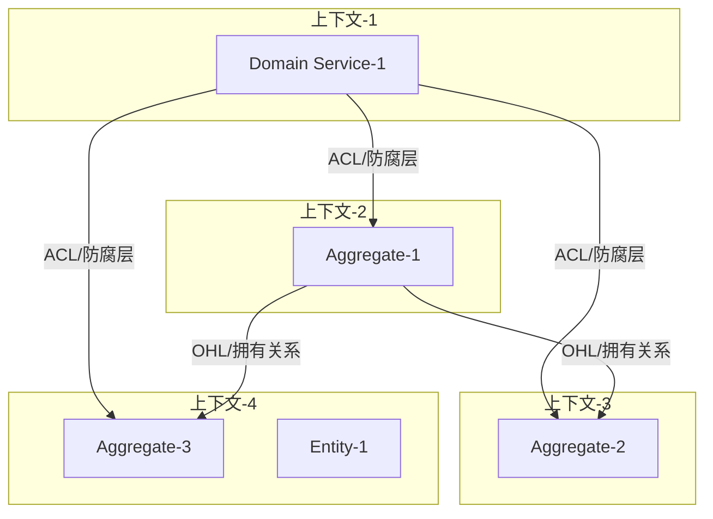
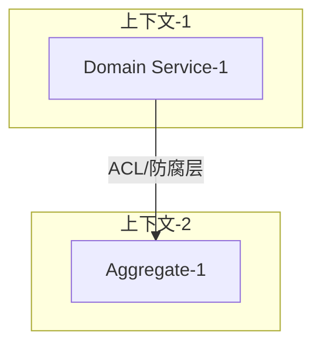

# 第一章：限界上下文设计

## 章节目标

完成限界上下文设计，包括：
1. **业务能力分析**：识别组织的核心业务能力，建立能力树
2. **限界上下文划分**：基于业务能力划分限界上下文
3. **上下文映射**：定义上下文间的集成关系和协作模式

---

## 输入来源

从 PRD 中提取以下信息：

| PRD 章节 | 提取内容 | 转化目标 |
|---------|---------|---------|
| 功能概述 | 核心业务动词 | 业务能力列表 |
| 核心实体 | 关键名词 | 业务实体 |
| 业务流程 | 能力依赖关系 | 能力依赖图 |
| 外部集成 | 外部系统 | 上下文映射 |
| 组织架构 | 团队信息 | 团队对齐 |

---

## 生成步骤

### Step 1：业务能力分析

**目标**：识别组织的所有业务能力，建立能力树。

#### 1.1 能力识别

从 PRD 中提取能力动词，使用"动词+名词"格式：

```
示例：
✅ 好的能力定义
- 管理会员订阅
- 发放点券
- 处理支付

❌ 差的能力定义
- 会员（缺少动词）
- 管理（缺少对象）
- 点击按钮（太具体，是操作不是能力）
```

#### 1.2 能力分解

按层级分解能力，构建能力树：

```
{业务领域}
├── {一级能力1}
│   ├── {二级能力1.1}
│   └── {二级能力1.2}
└── {一级能力2}
    ├── {二级能力2.1}
    └── {二级能力2.2}
```

**分解原则**：
- **MECE**：相互独立，完全穷尽
- **可独立交付**：一个能力可独立开发和部署
- **单一职责**：一个能力只做一件事

#### 1.3 能力分组

按数据所有权分组，确定领域类型：

| 类型 | 特征 | 投入策略 | 示例 |
|------|------|----------|------|
| **核心域** | 竞争力所在，差异化 | 80% 精力 | 定价算法、推荐引擎 |
| **支撑域** | 必要但非差异化 | 够用就好 | 会员系统、通知系统 |
| **通用域** | 可直接采购 | 直接购买/外包 | 支付、短信、存储 |
| **泛化域** | 无特殊规则 | 最小投入 | 日志、监控 |

#### 1.4 团队对齐

应用康威定律，建立能力-团队映射：

| 能力组 | 负责团队 | 团队规模 | 联系方式 |
|--------|----------|----------|----------|
| {能力组1} | {团队A} | {人数} | {联系方式} |

**参考文档**：[references/principles/bounded-context.md](references/principles/bounded-context.md)

---

### Step 2：限界上下文划分

**目标**：基于业务能力划分限界上下文。

#### 2.1 上下文识别

按能力组划分上下文：

| 上下文名称 | 负责的业务能力 | 核心实体 | 上下文类型 |
|----------|--------------|---------|----------|
| {上下文1} | {能力描述} | {实体1}<br>{实体2} | 核心域/支撑域/通用域 |

**划分原则**：
- 一个上下文 = 一组高内聚的能力
- 上下文间低耦合
- 上下文边界清晰

**参考文档**：[references/principles/bounded-context.md](references/principles/bounded-context.md)

---

### Step 3：上下文映射

**目标**：定义上下文间的集成关系和协作模式。

#### 3.1 依赖分析

分析上下文间的依赖关系：

```
示例：
会员上下文依赖用户上下文（需要用户信息）
点券上下文依赖会员上下文（需要会员状态）
支付上下文被会员上下文依赖（处理支付）
```

#### 3.2 映射模式选择

根据依赖关系选择映射模式：

| 模式 | 符号 | 关系类型 | 适用场景 |
|------|------|----------|----------|
| **O/C** | → | 上游/下游 | 有明确的依赖方向 |
| **D + ACL** | → | 防腐层 | 集成外部系统或遗留系统 |
| **PL** | ⇄ | 发布语言 | 多个上下文需要共享信息 |
| **CF** | ◆ | 共享内核 | 多个上下文有共同的核心概念 |
| **SC** | ⊂ | 独占客户 | 为特定大客户定制功能 |
| **OH** | ○ | 开放主机 | 提供公共服务 |

**选择决策树**：
```
是否集成外部系统？
├── 是 → D + ACL（防腐层）
└── 否 → 是否需要共享核心模型？
    ├── 是 → CF（共享内核）
    └── 否 → 是否需要明确契约？
        ├── 是 → PL（发布语言）
        └── 否 → O/C（上游/下游）
```

#### 3.3 集成方式确定

确定集成方式：

| 集成方式 | 适用场景 | 优点 | 缺点 |
|---------|---------|------|------|
| 同步调用 | 需要实时响应 | 实时反馈 | 耦合度高 |
| 异步事件 | 可以异步处理 | 解耦 | 最终一致性 |
| 消息队列 | 解耦和削峰 | 高可靠性 | 复杂度高 |

#### 3.4 防腐层设计

对于需要防腐层的集成，定义转换逻辑：

| 防腐层位置 | 目标上下文 | 转换逻辑 |
|-----------|-----------|---------|
| {位置} | {上下文C} | 将 C 的 DTO 转换为本域的领域模型 |

**参考文档**：[references/principles/bounded-context.md](references/principles/bounded-context.md)

---

### Step 4：绘制上下文关系图

使用 Mermaid 绘制上下文关系图：



---

## 输出格式

### 1. 业务能力分析

#### 1.1 业务能力树

```
{业务领域}
├── {一级能力1}
│   ├── {二级能力1.1}
│   └── {二级能力1.2}
└── {一级能力2}
    ├── {二级能力2.1}
    └── {二级能力2.2}
```

#### 1.2 能力分级

| 能力 | 类型 | 说明 | 战略重要性 |
|------|------|------|-----------|
| {能力1} | 核心域 | 差异化竞争力 | 高 |
| {能力2} | 支撑域 | 必要但非差异化 | 中 |
| {能力3} | 通用域 | 可外包/复用 | 低 |

#### 1.3 能力与团队对齐

| 能力 | 负责团队 | 上下游关系 |
|------|---------|-----------|
| {能力1} | {团队A} | 上游：{能力X}，下游：{能力Y} |

---

### 2. 限界上下文划分

#### 2.1 上下文识别

| 上下文名称 | 负责的业务能力 | 核心实体 | 上下文类型 |
|----------|--------------|---------|----------|
| {上下文1} | {能力描述} | {实体1}<br>{实体2} | 核心域 |
| {上下文2} | {能力描述} | {实体3}<br>{实体4} | 支撑域 |

---

### 3. 上下文映射

#### 3.1 上下文关系图



#### 3.2 集成模式定义

| 上游 | 下游 | 关系类型 | 集成模式 | 说明 |
|------|------|---------|---------|------|
| {上下文A} | {上下文B} | 上游下游 | O/C（上游/下游） | A 的变化影响 B |
| {上下文B} | {上下文C} | 独立 | ACL（防腐层） | C 通过防腐层调用 B |

#### 3.3 防腐层设计

| 防腐层位置 | 目标上下文 | 转换逻辑 |
|-----------|-----------|---------|
| {位置} | {上下文C} | 将 C 的 DTO 转换为本域的领域模型 |

---

## 质量检查

完成本章后，使用以下检查清单自检：

### 检查清单

- [ ] 所有业务能力已识别，使用"动词+名词"格式
- [ ] 能力分解遵循 MECE 原则
- [ ] 能力分组清晰，组内高内聚，组间低耦合
- [ ] 每个能力都有明确的负责团队
- [ ] 领域类型已标注（核心/支撑/通用/泛化）
- [ ] 能力依赖关系已明确
- [ ] 优先级已排序
- [ ] 所有上下文已识别
- [ ] 上下游关系已明确
- [ ] 映射模式已选择
- [ ] 集成方式已确定
- [ ] 防腐层需求已识别
- [ ] 上下文映射图已绘制

### 评分标准

使用 [references/scoring/strategic-scoring.md](references/scoring/strategic-scoring.md) 评分。

**及格线**：60 分

**评分维度**：
- 业务能力分析（30 分）
- 限界上下文划分（40 分）
- 上下文映射（30 分）

---

## 常见问题

### Q1: 能力分解到什么程度？

**原则**：分解到"可独立开发交付"的最小粒度。

```
❌ 太粗：会员管理（包含太多）
❌ 太细：点击订阅按钮（太具体）
✅ 适中：会员订阅（独立可交付）
```

### Q2: 如何处理跨领域的能力？

**方法**：
1. 识别能力的所有权
2. 选择"主要数据所有者"作为归属
3. 通过领域事件协作

```
"支付成功通知"：
- 数据所有者：支付域（支付记录）
- 业务消费者：会员域（需要激活会员）
- 解决方案：支付域发布事件，会员域订阅
```

### Q3: 业务能力和限界上下文的关系？

```
业务能力分析 → 识别能力
         ↓
限界上下文划分 → 按能力分组划分上下文
         ↓
上下文映射 → 定义能力（上下文）间的协作
```

### Q4: 如何选择映射模式？

使用决策树：

```
是否集成外部系统？
├── 是 → D + ACL（防腐层）
└── 否 → 是否需要共享核心模型？
    ├── 是 → CF（共享内核）
    └── 否 → 是否需要明确契约？
        ├── 是 → PL（发布语言）
        └── 否 → O/C（上游/下游）
```

### Q5: 上下文边界如何确定？

**原则**：
- 一个上下文 = 一组高内聚的能力
- 上下文间低耦合
- 上下文边界清晰

**方法**：
- 按数据所有权分组
- 按业务能力分组
- 按团队边界分组（康威定律）
