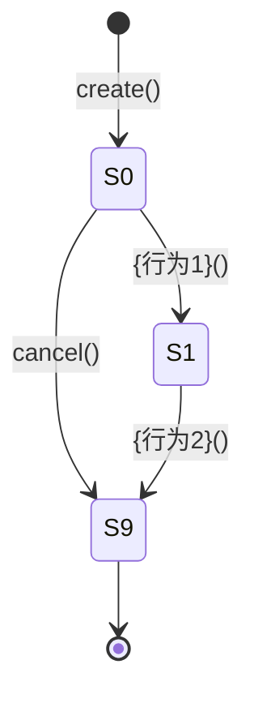

# 第二章：聚合设计

## 章节目标

完成聚合设计，包括：
1. **聚合总览**：识别所有聚合，定义聚合间关系
2. **单个聚合详细设计**：设计每个聚合的结构、状态、行为
3. **实体设计**：设计聚合内的实体
4. **值对象设计**：设计聚合内的值对象

---

## 输入来源

从 PRD 和第一章中提取以下信息：

| 来源 | 提取内容 | 转化目标 |
|------|---------|---------|
| PRD 业务流程 | 核心名词和动词 | 聚合根候选 |
| PRD 数据模型 | 实体关系 | 聚合边界 |
| PRD 不变量 | 一致性要求 | 聚合设计 |
| 第一章 限界上下文 | 上下文边界 | 聚合所在上下文 |
| PRD 业务规则 | 状态转移 | 聚合状态机 |

---

## 生成步骤

### Step 1：聚合识别

**目标**：识别所有聚合根，确定聚合边界。

#### 1.1 聚合根判断三问法

对每个核心实体，回答三个问题：

| 问题 | 说明 | 示例 |
|------|------|------|
| **有全局唯一标识吗？** | 需要 ID 来区分身份 | Order 有 orderId |
| **有独立生命周期吗？** | 可独立创建、删除 | Order 可独立创建 |
| **维护一致性边界吗？** | 封装业务不变量 | Order 维护订单总额不变量 |

**判断结果**：三个问题都答"是" → 聚合根候选

#### 1.2 聚合根 vs 实体

| 维度 | 聚合根 | 实体 |
|------|--------|------|
| 标识 | 全局唯一 ID | 局部唯一 ID（通常无独立 ID） |
| 访问 | 外部可直接访问 | 只能通过聚合根访问 |
| 生命周期 | 独立 | 依赖聚合根 |
| 仓储 | 有专门仓储 | 无专门仓储 |
| 示例 | Order | OrderItem |

#### 1.3 聚合根识别决策树

```
这个对象是聚合根吗？
│
├─ 有全局唯一标识吗？
│   ├─ 否 → 非聚合根
│   └─ 是 → 继续
│
├─ 有独立生命周期吗？
│   ├─ 否 → 非聚合根
│   └─ 是 → 继续
│
├─ 需要维护一致性吗？
│   ├─ 否 → 可能是值对象
│   └─ 是 → 聚合根候选
│
└─ 会被其他对象直接引用吗？
    ├─ 是 → 聚合根
    └─ 否 → 可能是实体
```

**参考文档**：[references/principles/aggregate.md](references/principles/aggregate.md)

---

### Step 2：聚合边界确定

**目标**：确定每个聚合的边界，定义聚合成员。

#### 2.1 聚合边界原则

| 原则 | 说明 | 示例 |
|------|------|------|
| **聚合尽量小** | 只包含强一致性的对象 | Order 只包含 OrderItem |
| **聚合根是唯一入口** | 只能通过聚合根访问 | 只能通过 Order 访问 OrderItem |
| **引用通过 ID** | 不存储对象引用 | Order 存储 userId，而不是 User |
| **强一致性边界** | 聚合内数据强一致 | Order 和 OrderItem 总额强一致 |

#### 2.2 聚合间引用

| 引用方式 | 说明 | 示例 |
|---------|------|------|
| **ID 引用** | 存储 ID，不存储对象 | Order.userId |
| **领域事件** | 通过事件异步通信 | MembershipActivated → CouponGrant |
| **值对象** | 共享不可变数据 | Money, Address |

#### 2.3 聚合清单

| 聚合名称 | 聚合根 | 聚合边界 | 一致性保证 |
|---------|--------|---------|-----------|
| {聚合1} | {聚合根实体} | 包含的实体/值对象 | {不变量描述} |

**参考文档**：[references/principles/aggregate.md](references/principles/aggregate.md)

---

### Step 3：聚合结构设计

**目标**：设计每个聚合的内部结构。

#### 3.1 聚合成员识别

对每个聚合，识别其成员：

| 成员类型 | 说明 | 示例 |
|---------|------|------|
| **聚合根** | 唯一入口，维护一致性 | Order |
| **实体** | 有 ID，但生命周期依赖聚合根 | OrderItem |
| **值对象** | 不可变，用值判断相等 | Money, Address |

#### 3.2 聚合结构图

```
{聚合根}
├── {实体1}（实体）
│   └── {值对象1}（值对象）
└── {值对象2}（值对象）
```

#### 3.3 聚合成员表格

| 成员名称 | 类型 | 说明 |
|---------|------|------|
| {聚合根} | 聚合根 | {说明} |
| {实体1} | 实体 | {说明} |
| {值对象1} | 值对象 | {说明} |

---

### Step 4：聚合根设计

**目标**：设计聚合根的属性、状态、行为。

#### 4.1 聚合根属性

| 属性名 | 类型 | 说明 |
| ------ | ---- | ---- |
| {属性1} | {类型1} | {属性1说明} |
| {属性2} | {类型2} | {属性2说明} |

#### 4.2 状态定义

| 状态码 | 状态名称 | 含义 | 可转移状态 |
| ------ | -------- | ---- | ---------- |
| {S0} | {状态1} | {状态1含义} | {可转移状态列表} |
| {S1} | {状态2} | {状态2含义} | {可转移状态列表} |

#### 4.3 状态转移图



#### 4.4 核心行为

| 行为名称 | 参数 | 返回值 | 业务规则 |
| -------- | ---- | ------ | -------- |
| {行为1}() | {参数列表} | {返回类型} | {业务规则描述} |

---

### Step 5：行为设计

**目标**：设计聚合根的每个行为。

#### 5.1 方法签名

```typescript
{方法名}(params: { {参数1}: {类型1}, {参数2}: {类型2} }): {返回类型}
```

#### 5.2 业务含义

{行为的业务含义描述}

#### 5.3 前置条件

- {前置条件1}
- {前置条件2}

#### 5.4 后置条件

- 状态 = {新状态}
- {属性1} = params.{参数1}

#### 5.5 约束定义

| 约束ID | 类型 | 描述 | 伪代码 | 执行时机 |
|-------|------|------|-------|---------|
| STR-{聚合缩写}-01 | 结构约束 | {约束描述} | `ASSERT {条件表达式}` | 创建时 |

#### 5.6 用例设计

**Case-{聚合缩写}-N1: {正向场景}**

| Given | When | Then | 验证约束 |
|-------|------|------|---------|
| {前置状态} | {方法名}({参数}={值}) | {结果描述} | STR-{聚合缩写}-01 ✓ |

**Case-{聚合缩写}-B1: {约束违反场景}**

| Given | When | Then | 违反约束 |
|-------|------|------|---------|
| {前置状态} | {方法名}({参数}={非法值}) | 拒绝，"{错误信息}" | STR-{聚合缩写}-01 ✗ |

**Case-{聚合缩写}-E1: 边界场景**

| Given | When | Then | 验证约束 |
|-------|------|------|---------|
| {边界条件} | {方法名}({参数}={边界值}) | {结果描述} | STR-{聚合缩写}-01 ✓ |

---

### Step 6：实体设计

**目标**：设计聚合内的实体。

#### 6.1 实体识别

实体识别三条件：

| 条件 | 说明 | 示例 |
|------|------|------|
| **有标识吗？** | 需要局部唯一 ID | OrderItem 有 itemId |
| **可变吗？** | 属性可以变化 | OrderItem 数量可变 |
| **生命周期依赖聚合根吗？** | 不能独立存在 | OrderItem 依赖 Order |

#### 6.2 实体属性

| 属性名 | 类型 | 说明 |
| ------ | ---- | ---- |
| {属性1} | {类型1} | {属性1说明} |
| {属性2} | {类型2} | {属性2说明} |

#### 6.3 实体行为

| 行为名称 | 参数 | 返回值 | 业务规则 |
| -------- | ---- | ------ | -------- |
| {行为1}() | {参数列表} | {返回类型} | {业务规则描述} |

**参考文档**：[references/principles/aggregate.md](references/principles/aggregate.md)

---

### Step 7：值对象设计

**目标**：设计聚合内的值对象。

#### 7.1 值对象识别

值对象识别三条件：

| 条件 | 说明 | 示例 |
|------|------|------|
| **无标识吗？** | 用值判断相等 | Money 用 amount+currency 判断 |
| **不可变吗？** | 创建后不能修改 | Money 的 amount 不能修改 |
| **可复用吗？** | 可在多处使用 | Money 可用于 Order、Payment |

#### 7.2 值对象属性

| 属性名 | 类型 | 说明 |
| ------ | ---- | ---- |
| {属性1} | {类型1} | {属性1说明} |
| {属性2} | {类型2} | {属性2说明} |

#### 7.3 值对象约束

| 约束ID | 类型 | 描述 | 伪代码 | 执行时机 |
|-------|------|------|-------|---------|
| STR-{VO缩写}-01 | 结构约束 | {约束描述} | `ASSERT {条件表达式}` | 创建时 |

**参考文档**：[references/principles/aggregate.md](references/principles/aggregate.md)

---

## 输出格式

### 1. 聚合总览

#### 1.1 聚合清单

| 聚合名称 | 聚合根 | 聚合边界 | 一致性保证 |
|---------|--------|---------|-----------|
| {聚合1} | {聚合根实体} | 包含的实体/值对象 | {不变量描述} |

#### 1.2 聚合间关系图

```
{聚合根}
├── {实体1}（实体）
│   └── {值对象1}（值对象）
└── {实体2}（实体）
```

#### 1.3 聚合间引用

| 聚合 | 引用方式 | 目标聚合 | 引用类型 |
|------|---------|---------|---------|
| {聚合A} | ID 引用 | {聚合B} | 直接引用 |
| {聚合C} | 领域事件 | {聚合D} | 事件驱动 |

---

### 2. 单个聚合详细设计

#### 2.1 聚合结构

**聚合成员**：

| 成员名称 | 类型 | 说明 |
|---------|------|------|
| {聚合根} | 聚合根 | {说明} |
| {实体1} | 实体 | {说明} |
| {值对象1} | 值对象 | {说明} |

**结构图**：

```
{聚合根}
├── {实体1}（实体）
│   └── {值对象1}（值对象）
└── {值对象2}（值对象）
```

---

#### 2.2 聚合根：{聚合根名称}

**职责**：{简要描述聚合根的核心职责和生命周期管理范围}

**唯一标识**：{标识字段名称}（{生成方式/规则}）

**核心属性**：

| 属性名 | 类型 | 说明 |
| ------ | ---- | ---- |
| {属性1} | {类型1} | {属性1说明} |
| {属性2} | {类型2} | {属性2说明} |

**状态定义**：

| 状态码 | 状态名称 | 含义 | 可转移状态 |
| ------ | -------- | ---- | ---------- |
| {S0} | {状态1} | {状态1含义} | {可转移状态列表} |
| {S1} | {状态2} | {状态2含义} | {可转移状态列表} |

**状态转移图**：


**核心行为**：

| 行为名称 | 参数 | 返回值 | 业务规则 |
| -------- | ---- | ------ | -------- |
| {行为1}() | {参数列表} | {返回类型} | {业务规则描述} |

---

#### 2.3 行为设计：{行为1}

**方法签名**：

```typescript
create(params: { {参数1}: {类型1}, {参数2}: {类型2} }): {聚合根名称}
```

**业务含义**：{创建聚合的业务含义描述}

**前置条件**：
- {前置条件1}
- {前置条件2}

**后置条件**：
- 状态 = S0
- {属性1} = params.{参数1}

**约束定义**：

| 约束ID | 类型 | 描述 | 伪代码 | 执行时机 |
|-------|------|------|-------|---------|
| STR-{聚合缩写}-01 | 结构约束 | {约束描述} | `ASSERT {条件表达式}` | 创建时 |

**用例设计**：

**Case-{聚合缩写}-N1: {正向场景}**

| Given | When | Then | 验证约束 |
|-------|------|------|---------|
| {前置状态} | {方法名}({参数}={值}) | {结果描述} | STR-{聚合缩写}-01 ✓ |

**Case-{聚合缩写}-B1: {约束违反场景}**

| Given | When | Then | 违反约束 |
|-------|------|------|---------|
| {前置状态} | {方法名}({参数}={非法值}) | 拒绝，"{错误信息}" | STR-{聚合缩写}-01 ✗ |

**Case-{聚合缩写}-E1: 边界场景**

| Given | When | Then | 验证约束 |
|-------|------|------|---------|
| {边界条件} | {方法名}({参数}={边界值}) | {结果描述} | STR-{聚合缩写}-01 ✓ |

---

#### 2.4 实体：{实体名称}

**职责**：{简要描述实体的核心职责}

**唯一标识**：{标识字段名称}（{生成方式/规则}）

**核心属性**：

| 属性名 | 类型 | 说明 |
| ------ | ---- | ---- |
| {属性1} | {类型1} | {属性1说明} |

**核心行为**：

| 行为名称 | 参数 | 返回值 | 业务规则 |
| -------- | ---- | ------ | -------- |
| {行为1}() | {参数列表} | {返回类型} | {业务规则描述} |

---

#### 2.5 值对象：{值对象名称}

**职责**：{简要描述值对象的核心职责}

**核心属性**：

| 属性名 | 类型 | 说明 |
| ------ | ---- | ---- |
| {属性1} | {类型1} | {属性1说明} |

**约束定义**：

| 约束ID | 类型 | 描述 | 伪代码 | 执行时机 |
|-------|------|------|-------|---------|
| STR-{VO缩写}-01 | 结构约束 | {约束描述} | `ASSERT {条件表达式}` | 创建时 |

---

## 质量检查

完成本章后，使用以下检查清单自检：

### 检查清单

- [ ] 所有聚合根已识别（三问法验证）
- [ ] 聚合边界清晰，符合"小聚合"原则
- [ ] 聚合根是唯一入口
- [ ] 聚合间引用通过 ID
- [ ] 聚合内强一致性已定义
- [ ] 聚合根状态机已设计
- [ ] 聚合根行为已设计
- [ ] 每个行为都有约束定义
- [ ] 每个行为都有用例设计
- [ ] 实体已设计
- [ ] 值对象已设计
- [ ] 所有约束都有 ID 和伪代码

### 评分标准

使用 [references/scoring/chapter-02-scoring.md](references/scoring/chapter-02-scoring.md) 评分。

**及格线**：60 分

**评分维度**：
- 聚合识别（20 分）
- 聚合设计（40 分）
- 约束定义（20 分）
- 用例设计（20 分）

---

## 常见问题

### Q1: 聚合根判断三问法是什么？

| 问题 | 说明 | 示例 |
|------|------|------|
| **有全局唯一标识吗？** | 需要 ID 来区分身份 | Order 有 orderId |
| **有独立生命周期吗？** | 可独立创建、删除 | Order 可独立创建 |
| **维护一致性边界吗？** | 封装业务不变量 | Order 维护订单总额不变量 |

**判断结果**：三个问题都答"是" → 聚合根候选

### Q2: 聚合边界如何确定？

**原则**：
- **聚合尽量小**：只包含强一致性的对象
- **聚合根是唯一入口**：只能通过聚合根访问
- **引用通过 ID**：不存储对象引用
- **强一致性边界**：聚合内数据强一致

### Q3: 实体和值对象的区别？

| 维度 | 实体 | 值对象 |
|------|------|--------|
| 标识 | 有 ID | 无 ID，用值判断相等 |
| 可变性 | 可变 | 不可变 |
| 生命周期 | 依赖聚合根 | 可独立存在 |

### Q4: 聚合间如何引用？

| 引用方式 | 说明 | 示例 |
|---------|------|------|
| **ID 引用** | 存储 ID，不存储对象 | Order.userId |
| **领域事件** | 通过事件异步通信 | MembershipActivated → CouponGrant |
| **值对象** | 共享不可变数据 | Money, Address |

### Q5: 状态转移如何设计？

**步骤**：
1. 识别所有状态
2. 确定状态间的转移条件
3. 绘制状态转移图
4. 定义每个行为的转移规则
