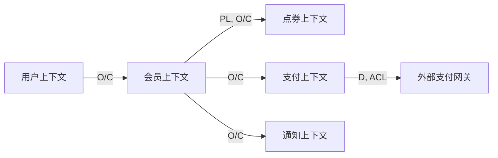

# 上下文映射方法论

## 概述

上下文映射（Context Mapping）定义了不同限界上下文之间的集成关系和协作模式。它是 DDD 战略设计的重要组成部分，帮助团队管理上下文间的复杂性。

## 核心概念

```
限界上下文之间的协作关系

┌─────────────┐                    ┌─────────────┐
│  Context A  │───────────────────▶│  Context B  │
│  (上游)     │   集成关系          │  (下游)     │
└─────────────┘                    └─────────────┘
     ▲                                    │
     │                                    │
     └────────────────────────────────────┘
          上下文映射模式
```

## 上下文映射模式

### 模式总览

| 模式 | 符号 | 关系类型 | 集成方式 | 变更影响 |
|------|------|----------|----------|----------|
| **O/C** | → | 上游/下游 | 同步/异步 | 下游受上游影响 |
| **D** | → | 防腐层 | 领域模型转换 | 下游隔离上游变化 |
| **ACL** | → | 防腐层实现 | 领域模型转换 | 隔离上游变化 |
| **PL** | ⇄ | 发布语言 | 共享模型 | 双方协商变更 |
| **CF** | ◆ | 共享内核 | 共享模型 | 双方协调变更 |
| **SC** | ⊂ | 独占客户 | 定制集成 | 上游受下游约束 |
| **OH** | ○ | 开放主机 | 标准化 API | 上游独立演进 |

### 1. 上游/下游（Upstream/Downstream, O/C）

#### 定义

- **上游（Upstream）**：提供服务的上下文
- **下游（Downstream）**：消费服务的上下文
- **特征**：上游不关心下游，下游受上游影响

#### 适用场景

- 上下文间有明确的依赖方向
- 上游独立演进，不关心下游

#### 示例

```markdown
## 会员上下文 → 点券上下文

会员上下文（上游）
- 发布会员激活事件
- 不关心谁消费这个事件

点券上下文（下游）
- 订阅会员激活事件
- 开始每日点券发放

集成方式：异步事件
```

#### 代码示例

```typescript
// 上游：会员上下文
class Membership {
  activate(): void {
    this.status = MembershipStatus.ACTIVE
    // 发布事件，不关心谁消费
    this.addEvent(new MembershipActivated(this.id, this.userId))
  }
}

// 下游：点券上下文
class CouponEventHandler {
  onMembershipActivated(event: MembershipActivated): void {
    // 开始每日点券发放
    this.scheduleDailyGrant(event.membershipId)
  }
}
```

### 2. 防腐层（Anticorruption Layer, D + ACL）

#### 定义

- **防腐层（ACL）**：隔离上游变化的层
- **特征**：将上游模型转换为下游模型

#### 适用场景

- 集成外部系统或遗留系统
- 上游模型不符合下游领域逻辑
- 需要隔离上游的变化

#### 示例

```markdown
## 支付上下文 → 外部支付网关

支付上下文（下游）
- 使用自己的领域模型
- 通过防腐层隔离外部变化

外部支付网关（上游）
- 使用外部模型
- 可能随时变化

防腐层
- 将外部模型转换为内部模型
- 隔离外部变化
```

#### 代码示例

```typescript
// 外部支付网关模型
interface ExternalPaymentResponse {
  payment_id: string
  status_code: number
  transaction_time: string
  amount_in_cents: number
  currency_code: string
}

// 支付上下文模型
class Payment {
  id: PaymentId
  status: PaymentStatus
  transactionTime: Date
  amount: Money
}

// 防腐层：将外部模型转换为内部模型
class PaymentACL {
  toDomain(response: ExternalPaymentResponse): Payment {
    return new Payment(
      new PaymentId(response.payment_id),
      this.mapStatus(response.status_code),
      new Date(response.transaction_time),
      new Money(
        BigInt(response.amount_in_cents),
        response.currency_code
      )
    )
  }

  private mapStatus(code: number): PaymentStatus {
    const statusMap = {
      0: PaymentStatus.PENDING,
      1: PaymentStatus.SUCCESS,
      2: PaymentStatus.FAILED
    }
    return statusMap[code] ?? PaymentStatus.UNKNOWN
  }
}
```

### 3. 发布语言（Published Language, PL）

#### 定义

- **发布语言**：上下文间共享的通信语言
- **特征**：双方协商定义，变更需要协调

#### 适用场景

- 多个上下文需要共享信息
- 需要明确的事件/数据契约
- 跨团队协作

#### 示例

```markdown
## 会员上下文 ⇄ 点券上下文

发布语言：会员事件契约

MembershipActivated 事件
{
  eventId: string
  membershipId: string
  userId: string
  level: "BASIC" | "PREMIUM" | "VIP"
  activatedAt: string
}

双方约定：
- 会员上下文发布这个格式的事件
- 点券上下文按这个格式解析
- 变更需要双方协商
```

#### 代码示例

```typescript
// 发布语言：共享的事件定义
export interface MembershipActivatedEvent {
  eventId: string
  membershipId: string
  userId: string
  level: "BASIC" | "PREMIUM" | "VIP"
  activatedAt: string
}

// 发布方：会员上下文
class MembershipEventPublisher {
  publishActivation(membership: Membership): void {
    const event: MembershipActivatedEvent = {
      eventId: uuid(),
      membershipId: membership.id.value,
      userId: membership.userId.value,
      level: membership.level,
      activatedAt: new Date().toISOString()
    }
    this.eventBus.publish("MembershipActivated", event)
  }
}

// 订阅方：点券上下文
class CouponEventHandler {
  onMembershipActivated(event: MembershipActivatedEvent): void {
    // 使用发布语言定义的格式
    this.couponService.startDailyGrant(
      new MembershipId(event.membershipId),
      new UserId(event.userId)
    )
  }
}
```

### 4. 共享内核（Shared Kernel, CF）

#### 定义

- **共享内核**：多个上下文共享的小型核心模型
- **特征**：双方协调变更，同步演进

#### 适用场景

- 多个上下文有共同的核心概念
- 需要强一致性
- 同一个团队维护

#### 示例

```markdown
## 会员上下文 ◆ 点券上下文

共享内核：会员等级定义

MembershipLevel 值对象
- BASIC: 基础会员
- PREMIUM: 高级会员
- VIP: 尊享会员

双方约定：
- 使用相同的等级定义
- 等级变更需要双方协调
- 共享代码库
```

#### 代码示例

```typescript
// 共享内核：在 shared-kernel 包中定义
export class MembershipLevel {
  static readonly BASIC = new MembershipLevel("BASIC", 1, 100)
  static readonly PREMIUM = new MembershipLevel("PREMIUM", 2, 200)
  static readonly VIP = new MembershipLevel("VIP", 3, 500)

  constructor(
    readonly code: string,
    readonly rank: number,
    readonly dailyCouponAmount: number
  ) {}
}

// 会员上下文使用
import { MembershipLevel } from "@shared-kernel/membership"

class Membership {
  level: MembershipLevel
}

// 点券上下文使用
import { MembershipLevel } from "@shared-kernel/membership"

class CouponService {
  getDailyAmount(level: MembershipLevel): number {
    return level.dailyCouponAmount
  }
}
```

### 5. 独占客户（Separate Ways, SC）

#### 定义

- **独占客户**：下游为上游定制特定集成
- **特征**：上游为特定客户定制功能

#### 适用场景

- 为特定大客户定制功能
- 需要深度集成

#### 示例

```markdown
## 外部服务 ⊂ 我们的系统

外部支付服务（上游）
- 为我们定制专属接口
- 按我们的需求开发

我们的系统（下游）
- 定制化集成
- 获得差异化服务
```

### 6. 开放主机服务（Open Host Service, OH）

#### 定义

- **开放主机服务**：提供标准化 API
- **特征**：上游独立演进，下游按标准接入

#### 适用场景

- 提供公共服务
- 对外开放 API
- 支持多个下游

#### 示例

```markdown
## 会员上下文 ○ 所有订阅者

会员上下文（上游）
- 提供标准化的事件 API
- 发布事件契约文档
- 独立演进

所有订阅者（下游）
- 按标准接入
- 适配自己的模型
```

#### 代码示例

```typescript
// 开放主机：定义公开的 API 契约
export interface MembershipPublicAPI {
  // 查询会员信息
  getMembership(userId: string): Promise<MembershipDTO>

  // 订阅会员事件
  subscribeToEvents(
    eventType: string,
    handler: (event: MembershipEventDTO) => void
  ): void
}

// DTO：公开的数据传输对象
export interface MembershipDTO {
  id: string
  userId: string
  status: "ACTIVE" | "EXPIRED" | "SUSPENDED"
  level: string
  startDate: string
  endDate: string
}

// 会员上下文实现
class MembershipService implements MembershipPublicAPI {
  async getMembership(userId: string): Promise<MembershipDTO> {
    const membership = await this.repo.findByUserId(new UserId(userId))
    return this.toDTO(membership)
  }

  private toDTO(membership: Membership): MembershipDTO {
    return {
      id: membership.id.value,
      userId: membership.userId.value,
      status: membership.status,
      level: membership.level.code,
      startDate: membership.startDate.toISOString(),
      endDate: membership.endDate.toISOString()
    }
  }
}
```

## 集成模式

### 同步集成

```typescript
// 下游同步调用上游
class OrderService {
  async createOrder(userId: string, items: OrderItem[]): Promise<Order> {
    // 同步调用会员上下文
    const membership = await this.membershipClient.getMembership(userId)

    // 根据会员等级计算折扣
    const discount = this.calculateDiscount(membership.level)

    // 创建订单
    return this.orderRepo.save(new Order(userId, items, discount))
  }
}
```

### 异步集成

```typescript
// 通过事件异步集成
class MembershipEventHandler {
  onMembershipActivated(event: MembershipActivated): void {
    // 异步处理，不阻塞主流程
    this.taskQueue.schedule(async () => {
      await this.couponService.startDailyGrant(event.membershipId)
    })
  }
}
```

## 上下文映射设计流程

### Step 1: 识别上下文

```
列出所有限界上下文：
- 会员上下文
- 点券上下文
- 支付上下文
- 用户上下文
- 通知上下文
```

### Step 2: 分析依赖关系

```
分析上下文间的依赖：
- 会员上下文依赖用户上下文（需要用户信息）
- 点券上下文依赖会员上下文（需要会员状态）
- 支付上下文被会员上下文依赖（处理支付）
```

### Step 3: 确定映射模式

```
根据依赖关系确定模式：
- 会员上下文 → 用户上下文：O/C（上游/下游）
- 点券上下文 → 会员上下文：O/C + PL（发布语言）
- 支付上下文 ← 会员上下文：O/C
- 支付上下文 → 外部网关：D + ACL（防腐层）
```

### Step 4: 设计集成方式

```
确定集成方式：
- 同步调用：需要实时响应
- 异步事件：可以异步处理
- 消息队列：解耦和削峰
```

### Step 5: 文档化

```markdown
## 上下文映射文档



| 上游 | 下游 | 模式 | 集成方式 | 说明 |
|------|------|------|----------|------|
| 用户上下文 | 会员上下文 | O/C | 同步 RPC | 会员需要用户信息 |
| 会员上下文 | 点券上下文 | PL, O/C | 异步事件 | 会员激活触发点券发放 |
| 会员上下文 | 支付上下文 | O/C | 同步 RPC | 创建订阅时调用支付 |
| 支付上下文 | 外部网关 | D, ACL | 同步 HTTP | 防腐层隔离外部变化 |
```

## 检查清单

上下文映射设计完成前，确认：

- [ ] 所有上下文已识别
- [ ] 上下游关系已明确
- [ ] 映射模式已选择
- [ ] 集成方式已确定
- [ ] 防腐层需求已识别
- [ ] 发布语言已定义（如果需要）
- [ ] 共享内核已定义（如果需要）
- [ ] 上下文映射图已绘制
- [ ] 集成文档已编写

## 常见错误

### 错误 1: 缺少防腐层

```typescript
// ❌ 错误：直接使用外部模型
class OrderService {
  async createPayment(amount: number): void {
    // 直接使用外部模型
    const response = await externalPaymentClient.create({
      amount_in_cents: amount,
      currency_code: "USD"
    })
    // 外部模型变化会影响这里
  }
}

// ✅ 正确：使用防腐层
class OrderService {
  async createPayment(amount: Money): Promise<Payment> {
    // 通过防腐层转换
    const payment = await this.paymentGateway.charge(amount)
    return this.acl.toDomain(payment)
  }
}
```

### 错误 2: 上下文间直接依赖领域模型

```typescript
// ❌ 错误：跨上下文使用领域模型
import { Membership } from "@membership/domain"  // 不应该直接导入

class CouponService {
  grantCoupon(membership: Membership): void {  // 不应该使用其他上下文的领域模型
    // ...
  }
}

// ✅ 正确：使用发布语言或 DTO
import { MembershipDTO } from "@membership/public-api"

class CouponService {
  grantCoupon(membership: MembershipDTO): void {
    // ...
  }
}
```

## 参考资料

- Domain-Driven Design (Eric Evans) - Chapter 14
- Strategic Domain-Driven Design (Vaughn Vernon)
- Context Mapping Patterns (Nick Tune)
