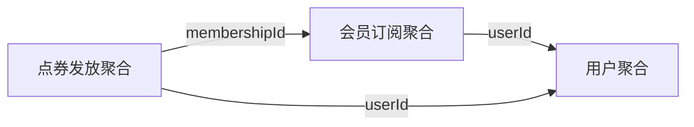

# 聚合设计 SOP

## 概述

聚合（Aggregate）是 DDD 战术设计的核心概念，定义了数据修改和事务的一致性边界。本 SOP 提供系统化的聚合设计方法。

## 目标

- 识别聚合根
- 确定聚合边界
- 设计聚合内部结构
- 定义聚合间引用关系

## 输入

- 限界上下文划分文档
- 业务能力清单
- PRD 中的业务规则

## 流程步骤

### Step 1: 候选聚合识别

#### 1.1 从业务能力推导聚合

```
业务能力 → 聚合映射

会员订阅能力 → 会员聚合（Membership）
点券发放能力 → 点券发放记录聚合（CouponGrant）
点券消费能力 → 点券消费记录聚合（CouponConsume）
```

#### 1.2 聚合识别三问法

对每个候选对象，问三个问题：

| 问题 | 是 → 聚合根 | 否 → 非聚合根 |
|------|------------|--------------|
| 有全局唯一标识吗？ | ✅ | ❌ |
| 有独立生命周期吗？ | ✅ | ❌ |
| 需要维护一致性边界吗？ | ✅ | ❌ |

#### 1.3 聚合根判断矩阵

| 候选对象 | 唯一标识 | 独立生命周期 | 一致性边界 | 结论 |
|----------|----------|--------------|------------|------|
| 会员订阅 | ✅ membershipId | ✅ 创建→生效→过期 | ✅ 状态变更需一致 | **聚合根** |
| 订单 | ✅ orderId | ✅ 创建→支付→完成 | ✅ 订单项一起变更 | **聚合根** |
| 订单项 | ❌ 无独立 ID | ❌ 依赖订单 | ❌ 随订单一起变更 | 非聚合根 |
| 金额 | ❌ 值对象 | ❌ 无生命周期 | ❌ 不可变 | 值对象 |

### Step 2: 聚合边界确定

#### 2.1 聚合设计原则

| 原则 | 说明 | 示例 |
|------|------|------|
| **聚合根唯一入口** | 外部只能通过聚合根访问 | 订单项只能通过订单访问 |
| **聚合尽量小** | 一个聚合根 + 少量实体/值对象 | 订单只包含订单项 |
| **强一致性边界** | 聚合内部事务一致性 | 订单和订单项一起修改 |
| **引用通过 ID** | 聚合间引用只存 ID | 订单存储 userId，不是整个 User |

#### 2.2 聚合大小决策树

```
这个对象需要和聚合根一起修改吗？
│
├─ 是 → 是否必须强一致？
│        │
│        ├─ 是 → 放在聚合内（如：订单和订单项）
│        └─ 否 → 通过 ID 引用（如：订单和商品）
│
└─ 否 → 不应该在这个聚合内（如：订单和支付）
```

#### 2.3 聚合边界验证

```
验证清单：

1. 事务边界测试
   问：一个事务能完成这个聚合的修改吗？
   ✅ 能 → 边界合理
   ❌ 不能 → 聚合太大或太小

2. 并发冲突测试
   问：两个用户同时修改会冲突吗？
   ✅ 不会冲突 → 边界合理
   ❌ 会冲突 → 考虑拆分

3. 一致性需求测试
   问：这部分数据需要强一致吗？
   ✅ 需要 → 在聚合内
   ❌ 不需要 → 拆到不同聚合
```

### Step 3: 聚合内部结构设计

#### 3.1 聚合结构模板

```markdown
## 聚合：{聚合名称}

### 聚合根
{聚合根名称}

### 实体
- {实体 1}
- {实体 2}

### 值对象
- {值对象 1}
- {值对象 2}

### 聚合根职责
- {职责 1}
- {职责 2}

### 不变量
- {不变量 1}
- {不变量 2}
```

#### 3.2 聚合结构示例

```markdown
## 聚合：会员订阅（Membership）

### 聚合根
Membership（会员订阅）

### 实体
无（这个聚合只有聚合根）

### 值对象
- SubscriptionPeriod（订阅周期）
- MembershipLevel（会员等级）

### 聚合根职责
- 维护会员订阅状态
- 保证订阅规则的一致性
- 发布会员状态变更事件

### 不变量
- 一个用户只能有一个生效中的订阅
- 订阅结束日期必须晚于开始日期
- 过期的订阅不能发放点券
```

### Step 4: 聚合间引用设计

#### 4.1 引用方式决策

```
需要引用另一个聚合？
│
├─ 是 → 引用方式？
│        │
│        ├─ 只读访问 → 存储 ID + 查询获取
│        ├─ 需要协作 → 领域事件
│        └─ 强一致性 → 考虑合并聚合
│
└─ 否 → 无引用关系
```

#### 4.2 引用方式对比

| 方式 | 适用场景 | 示例 |
|------|----------|------|
| **直接 ID 引用** | 需要标识但不需要加载 | Order.userId |
| **领域事件** | 跨聚合协作 | MembershipActivated → 触发点券发放 |
| **领域服务** | 多聚合协作 | 转账（涉及两个 Account） |

#### 4.3 引用关系示例

```markdown
## 聚合引用关系

### 会员订阅聚合
```typescript
class Membership {
  id: MembershipId
  userId: UserId  // ← 直接引用 ID
  status: MembershipStatus
  // 不存储整个 User 对象
}
```

### 点券发放聚合
```typescript
class CouponGrant {
  id: GrantId
  userId: UserId  // ← 直接引用 ID
  membershipId: MembershipId  // ← 直接引用 ID
  amount: Money
  // 通过事件关联会员激活
}
```

### 事件关联
```typescript
// 会员上下文发布事件
MembershipActivated {
  membershipId: "m-001"
  userId: "u-001"
}

// 点券上下文订阅事件
on(MembershipActivated) {
  // 开始每日点券发放
}
```
```

### Step 5: 聚合行为设计

#### 5.1 行为归属判断

```
这个行为属于哪里？

│
├─ 涉及单个聚合的状态变更？
│        ├─ 是 → 实体/聚合根方法
│        └─ 否 → 继续
│
├─ 涉及多个聚合的协作？
│        ├─ 是 → 领域服务
│        └─ 否 → 继续
│
└─ 涉及外部系统/基础设施？
         └─ 是 → 应用服务
```

#### 5.2 行为分类示例

```markdown
## 聚合行为分类

### 聚合根方法（实体内部行为）
```typescript
class Membership {
  // 改变状态，只涉及自身
  activate(): void {
    this.status = MembershipStatus.ACTIVE
    this.addEvent(new MembershipActivated(this.id))
  }

  expire(): void {
    this.status = MembershipStatus.EXPIRED
    this.addEvent(new MembershipExpired(this.id))
  }
}
```

### 领域服务（多聚合协作）
```typescript
class MembershipService {
  // 涉及会员和点券两个聚合
  grantDailyCoupon(membershipId: MembershipId): void {
    const membership = this.membershipRepo.findById(membershipId)
    if (!membership.isActive()) {
      throw new Error("只有生效中的会员才能发放点券")
    }

    const grant = CouponGrant.create(membership.userId, 100)
    this.couponGrantRepo.save(grant)
  }
}
```

### 应用服务（流程编排）
```typescript
class MembershipAppService {
  // 编排整个订阅流程
  subscribe(userId: UserId, period: PeriodType): void {
    // 1. 调用支付
    this.paymentService.charge(userId, period.price)

    // 2. 创建会员
    const membership = Membership.create(userId, period)
    this.membershipRepo.save(membership)

    // 3. 发送通知
    this.notificationService.send(userId, "订阅成功")
  }
}
```
```

### Step 6: 仓储接口设计

#### 6.1 仓储原则

| 原则 | 说明 |
|------|------|
| **聚合根专属** | 仓储属于聚合根，不针对实体 |
| **隐藏持久化** | 隐藏数据库、缓存等细节 |
| **集合语义** | 提供类似集合的操作接口 |

#### 6.2 仓储接口模板

```typescript
interface AggregateRepository<T> {
  // 基本操作
  save(aggregate: T): Promise<void>
  findById(id: AggregateId): Promise<T | null>

  // 业务特定的查询
  findByCriteria(criteria: QueryCriteria): Promise<T[]>
  exists(criteria: QueryCriteria): Promise<boolean>

  // 删除（如果需要）
  delete(id: AggregateId): Promise<void>
}
```

#### 6.3 仓储接口示例

```typescript
interface MembershipRepository {
  // 基本操作
  save(membership: Membership): Promise<void>
  findById(id: MembershipId): Promise<Membership | null>

  // 业务查询
  findByUserId(userId: UserId): Promise<Membership | null>
  findActiveByUserId(userId: UserId): Promise<Membership | null>

  // 不变量验证
  existsActiveMembership(userId: UserId): Promise<boolean>
}
```

## 输出

### 聚合设计文档模板

```markdown
# 聚合设计文档

## 1. 聚合清单

| 聚合 ID | 聚合名称 | 聚合根 | 所属上下文 | 状态 |
|---------|----------|--------|------------|------|
| AG-001 | 会员订阅聚合 | Membership | 会员上下文 | 已设计 |
| AG-002 | 点券发放聚合 | CouponGrant | 点券上下文 | 已设计 |

## 2. 聚合详情

### AG-001: 会员订阅聚合

#### 聚合根
Membership（会员订阅）

#### 聚合结构
```
Membership (聚合根)
├── id: MembershipId
├── userId: UserId
├── status: MembershipStatus
├── period: SubscriptionPeriod (值对象)
├── level: MembershipLevel (值对象)
└── events: DomainEvent[]
```

#### 聚合根职责
- 维护会员订阅状态
- 保证订阅规则的一致性
- 发布会员状态变更事件

#### 不变量
- INV-1: 一个用户只能有一个生效中的订阅
- INV-2: 订阅结束日期必须晚于开始日期

#### 聚合根方法
- `activate()`: 激活会员
- `expire()`: 过期会员
- `suspend()`: 暂停会员
- `resume()`: 恢复会员

#### 仓储接口
```typescript
interface MembershipRepository {
  save(membership: Membership): Promise<void>
  findById(id: MembershipId): Promise<Membership | null>
  findByUserId(userId: UserId): Promise<Membership | null>
  existsActiveMembership(userId: UserId): Promise<boolean>
}
```

## 3. 聚合引用关系


```

## 验收标准

- [ ] 每个聚合都有明确的聚合根
- [ ] 聚合根有全局唯一标识
- [ ] 聚合边界清晰，大小合理
- [ ] 聚合内强一致，聚合间最终一致
- [ ] 聚合间引用只使用 ID
- [ ] 不变量已识别和文档化
- [ ] 仓储接口已定义
- [ ] 聚合行为已正确分类（实体方法/领域服务/应用服务）

## 常见问题

### Q1: 聚合应该多大？

**黄金法则**：让聚合尽可能小。

```
❌ 大聚合：User 包含 Order、Membership、Coupon
✅ 小聚合：Membership 只包含订阅相关数据
```

### Q2: 一个聚合根应该关联多少个其他聚合？

**建议**：尽量少，最好不超过 3-4 个。

```
如果关联太多：
1. 检查聚合边界是否合理
2. 考虑引入领域服务
3. 使用领域事件解耦
```

### Q3: 聚合和数据库表的关系？

```
聚合 ≠ 表

关系：
- 一个聚合可能对应多张表（聚合根 + 实体）
- 多个聚合可能存储在一张表中（值对象）
- 聚合是业务边界，表是持久化实现
```

## 工具支持

- 聚合设计画布（Aggregate Design Canvas）
- 聚合边界检查清单
- 仓储接口生成器

## 参考资料

- Domain-Driven Design (Eric Evans) - Chapter 6
- Implementing Domain-Driven Design (Vaughn Vernon) - Chapter 10-11
- Effective Aggregate Design (Martin Fowler)
