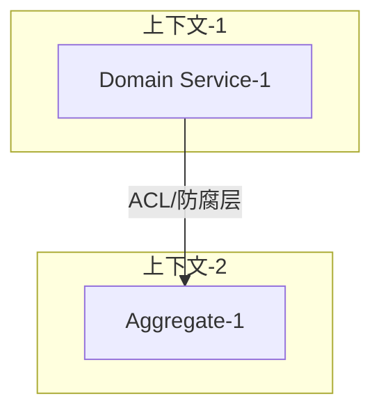

# 第一章：限界上下文设计

限界上下文设计：
1. **业务能力分析**：识别组织的核心业务能力，建立能力树
2. **限界上下文划分**：基于业务能力划分限界上下文
3. **上下文映射**：定义上下文间的集成关系和协作模式

---

### 1. 业务能力分析

#### 1.1 业务能力树

```
{业务领域}
├── {一级能力1}
│   ├── {二级能力1.1}
│   └── {二级能力1.2}
└── {一级能力2}
    ├── {二级能力2.1}
    └── {二级能力2.2}
```

#### 1.2 能力分级

| 能力 | 类型 | 说明 | 战略重要性 |
|------|------|------|-----------|
| {能力1} | 核心域 | 差异化竞争力 | 高 |
| {能力2} | 支撑域 | 必要但非差异化 | 中 |
| {能力3} | 通用域 | 可外包/复用 | 低 |

#### 1.3 能力与团队对齐

| 能力 | 负责团队 | 上下游关系 |
|------|---------|-----------|
| {能力1} | {团队A} | 上游：{能力X}，下游：{能力Y} |

---

### 2. 限界上下文划分

#### 2.1 上下文识别

| 上下文名称 | 子域 | 上下文类型 | 负责的业务能力 | 核心实体 |
|----------|----------|--------------|---------|
| {上下文1} | {子域1} | 核心域 | {能力描述} | {实体1}<br>{实体2} |
| {上下文1} | {子域2} | 支撑域 | {能力描述} | {实体3}<br>{实体4} |

---

### 3. 上下文映射

#### 3.1 上下文关系图



#### 3.2 集成模式定义

| 上游 | 下游 | 关系类型 | 集成模式 | 说明 |
|------|------|---------|---------|------|
| {上下文A} | {上下文B} | 上游下游 | O/C（上游/下游） | A 的变化影响 B |
| {上下文B} | {上下文C} | 独立 | ACL（防腐层） | C 通过防腐层调用 B |

#### 3.3 防腐层设计

| 防腐层位置 | 目标上下文 | 转换逻辑 |
|-----------|-----------|---------|
| {位置} | {上下文C} | 将 C 的 DTO 转换为本域的领域模型 |
