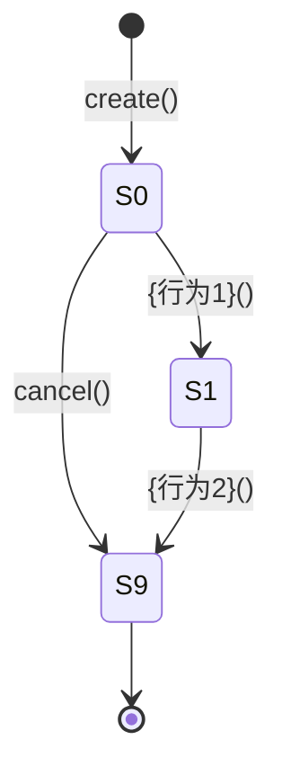

# 第二章：聚合设计

## 章节目标

完成聚合设计，包括：
1. **值对象设计**：先识别最简单的值对象
2. **实体设计**：在值对象基础上识别实体
3. **聚合根识别**：从实体中识别聚合根
4. **聚合边界确定**：确定聚合包含哪些成员
5. **聚合结构设计**：设计聚合的内部结构
6. **聚合根详细设计**：设计属性、状态、领域事件、行为

---

## 设计思路：从简单到复杂

领域专家设计聚合时，遵循**从简单到复杂**的原则：

```
值对象（最简单）
    ↓
实体（有 ID 的复杂对象）
    ↓
聚合根（全局唯一标识，维护一致性）
    ↓
聚合边界（包含哪些成员）
    ↓
聚合结构（内部关系）
    ↓
聚合根设计（属性、状态、事件、行为）
```

---

## 输入来源

从《限界上下文设计》中提取以下信息：

- 业务能力
- 上下文
- 子域
- 实体

---

## 生成步骤

### Step 1：值对象设计

> **为什么先设计值对象？**
> 值对象是最简单的领域元素，没有 ID，不可变，生命周期依附于宿主。
> 先识别值对象，可以避免将本应是值对象的元素错误设计为实体。

**目标**：识别所有值对象。

#### 1.1 值对象识别

值对象识别四问法：

| 问题 | 说明 | 示例 |
| --- | --- | --- |
| **只关注属性值吗？** | 不需要 ID，只关心数值或状态本身 | 颜色 `#FFFFFF`，坐标 `(x,y)` |
| **属性相同即可互换吗？** | 两个对象的属性完全一致时，视为相等 | 两个 `100 CNY` 的金额对象是相等的 |
| **是不可变 (Immutable) 的吗？** | 修改意味着替换整个对象，而非修改内部状态 | 修改地址时，创建一个新 `Address` 对象替换旧的 |
| **生命周期依附于他人吗？** | 随宿主创建而创建，随宿主销毁而销毁 | 订单被删除，订单内的 `收货地址` 也随之消失 |

**值对象识别决策树**：

```
这个对象是值对象吗？
│
├─ 只关注属性值吗（不需要 ID 区分身份）？
│   ├─ 否 → 可能是实体
│   └─ 是 → 继续
│
├─ 属性相同即可互换吗（如两个 100 元没区别）？
│   ├─ 否 → 可能是实体
│   └─ 是 → 继续
│
├─ 是不可变的吗（修改即替换整个对象）？
│   ├─ 否 → 建议重构为不可变
│   └─ 是 → 继续
│
└─ 生命周期依附于他人吗（随宿主同时销毁）？
    ├─ 是 → 【值对象】
    └─ 否 → 需评估是否应作为独立实体
```

#### 1.2 值对象设计

| 属性名 | 类型 | 说明 |
| ------ | ---- | ---- |
| {属性1} | {类型1} | {属性1说明} |
| {属性2} | {类型2} | {属性2说明} |

#### 1.3 值对象约束

| 约束ID | 类型 | 描述 | 伪代码 | 执行时机 |
|-------|------|------|-------|---------|
| STR-{VO缩写}-01 | 结构约束 | {约束描述} | `ASSERT {条件表达式}` | 创建时 |


---

### Step 2：实体设计

> **为什么第二步设计实体？**
> 实体比值对象复杂，有 ID、有生命周期、可变。
> 在识别值对象后，剩余的有 ID 对象就是实体候选。

**目标**：识别所有实体（包括聚合根候选和普通实体）。

#### 2.1 实体识别

实体识别四问法：

| 问题 | 说明 | 示例 |
| --- | --- | --- |
| **有唯一标识 (ID) 吗？** | 需要 ID 区分身份，即使属性完全相同也是不同个体 | 双胞胎（属性相同）是两个不同的人（实体） |
| **需要追踪状态变化吗？** | 具有生命周期，状态会随时间发生改变 | 订单从 `待支付` 变为 `已发货` |
| **属性变了还是同一个吗？** | 即使核心属性修改，ID 不变，身份依然存在 | 用户修改了昵称，但 `UserId` 没变，还是该用户 |
| **需要独立存储/检索吗？** | 即使脱离了上下文，它依然有独立存在的意义 | 哪怕没有订单，`商品 (Product)` 依然存在库房中 |

**实体识别决策树**：

```
这个对象是实体吗？
│
├─ 有唯一标识 ID 吗（用于区分身份）？
│   ├─ 否 → 可能是值对象
│   └─ 是 → 继续
│
├─ 需要追踪其状态变化吗（有生命周期）？
│   ├─ 否 → 可能是值对象
│   └─ 是 → 继续
│
├─ 属性变了它还是它吗（ID 保持不变）？
│   ├─ 否 → 可能是值对象
│   └─ 是 → 继续
│
└─ 需要独立存储或检索吗（脱离上下文仍有意义）？
    ├─ 是 → 【实体】
    └─ 否 → 可能是聚合内部的子实体或 DTO
```

#### 2.2 实体分类

识别出的实体需要进一步分类：

| 实体类型 | 说明 | 示例 |
|---------|------|------|
| **聚合根候选** | 有全局唯一 ID，可能作为聚合根 | Order, User, Membership |
| **子实体** | 有局部 ID，生命周期依赖聚合根 | OrderItem, MembershipCoupon |

#### 2.3 实体设计

| 属性名 | 类型 | 说明 |
| ------ | ---- | ---- |
| {属性1} | {类型1} | {属性1说明} |
| {属性2} | {类型2} | {属性2说明} |

#### 2.4 实体行为

| 行为名称 | 参数 | 返回值 | 业务规则 |
| -------- | ---- | ------ | -------- |
| {行为1}() | {参数列表} | {返回类型} | {业务规则描述} |


---

### Step 3：聚合根识别

> **为什么第三步识别聚合根？**
> 聚合根是实体的一个子集，具有特殊属性：全局唯一 ID、维护一致性边界、独立生命周期。
> 在识别所有实体后，从中筛选出聚合根。

**目标**：从实体中识别出聚合根。

#### 3.1 聚合根识别

聚合根识别四问法：

| 问题 | 说明 | 示例 |
| --- | --- | --- |
| **有全局唯一标识吗？** | ID 在整个系统范围内唯一，可被任意模块引用 | `OrderId` 是全局唯一的，任何服务都能引用 |
| **负责维护一致性边界吗？** | 确保内部所有子实体和值对象的规则不冲突 | `Order` 确保 `OrderItems` 的总价等于订单总额 |
| **拥有独立的生命周期吗？** | 可以独立创建、保存、删除，不依附于其他根 | `User` 可以独立注册，不需要依附于 `Order` |
| **是外部访问的唯一入口吗？** | 外部对象只能通过它来修改内部状态 | 只能通过 `Order` 修改收货地址，不能直接操作内部 `Address` |

**聚合根 vs 实体**：

| 维度 | 聚合根 | 实体 |
|------|--------|------|
| 标识 | 全局唯一 ID | 局部唯一 ID（通常无独立 ID） |
| 访问 | 外部可直接访问 | 只能通过聚合根访问 |
| 生命周期 | 独立 | 依赖聚合根 |
| 仓储 | 有专门仓储 | 无专门仓储 |
| 示例 | Order | OrderItem |

**聚合根识别决策树**：

```
这个实体是聚合根吗？
│
├─ 有全局唯一标识吗（可被系统其他模块引用）？
│   ├─ 否 → 非聚合根（可能是子实体）
│   └─ 是 → 继续
│
├─ 负责维护内部的一致性边界吗（保护业务规则）？
│   ├─ 否 → 考虑拆分或降级为普通实体
│   └─ 是 → 继续
│
├─ 拥有独立的生命周期吗（不依附于其他根）？
│   ├─ 否 → 可能是另一个聚合的组成部分
│   └─ 是 → 继续
│
└─ 是外部访问该聚合内部的唯一入口吗？
    ├─ 是 → 【聚合根】
    └─ 否 → 需收紧对象访问边界
```

---

### Step 4：聚合边界确定

> **为什么第四步确定聚合边界？**
> 识别聚合根后，需要确定每个聚合包含哪些成员（实体和值对象）。
> 聚合边界应该尽可能小，只包含强一致性的对象。

**目标**：确定每个聚合的边界，定义聚合成员。

#### 4.1 聚合边界原则

| 原则 | 说明 | 示例 |
|------|------|------|
| **聚合尽量小** | 只包含强一致性的对象 | Order 只包含 OrderItem |
| **聚合根是唯一入口** | 只能通过聚合根访问 | 只能通过 Order 访问 OrderItem |
| **引用通过 ID** | 不存储对象引用 | Order 存储 userId，而不是 User |
| **强一致性边界** | 聚合内数据强一致 | Order 和 OrderItem 总额强一致 |

#### 4.2 聚合间引用

| 引用方式 | 说明 | 示例 |
|---------|------|------|
| **ID 引用** | 存储 ID，不存储对象 | Order.userId |
| **领域事件** | 通过事件异步通信 | MembershipActivated → CouponGrant |
| **值对象** | 共享不可变数据 | Money, Address |

#### 4.3 聚合清单

| 聚合名称 | 聚合根 | 聚合边界 | 一致性保证 |
|---------|--------|---------|-----------|
| {聚合1} | {聚合根实体} | 包含的实体/值对象 | {不变量描述} |

---

### Step 5：聚合结构设计

> **为什么第五步设计聚合结构？**
> 确定聚合边界后，需要设计每个聚合的内部结构，包括聚合根、实体、值对象的关系。

**目标**：设计每个聚合的内部结构。

#### 5.1 聚合成员识别

对每个聚合，识别其成员：

| 成员类型 | 说明 | 示例 |
|---------|------|------|
| **聚合根** | 唯一入口，维护一致性 | Order |
| **实体** | 有 ID，但生命周期依赖聚合根 | OrderItem |
| **值对象** | 不可变，用值判断相等 | Money, Address |

#### 5.2 聚合结构图

```
{聚合根}
├── {实体1}（实体）
│   └── {值对象1}（值对象）
└── {值对象2}（值对象）
```

#### 5.3 聚合成员表格

| 成员名称 | 类型 | 说明 |
|---------|------|------|
| {聚合根} | 聚合根 | {说明} |
| {实体1} | 实体 | {说明} |
| {值对象1} | 值对象 | {说明} |

---

### Step 6：聚合根详细设计

> **为什么最后设计聚合根？**
> 在完成前面的识别和结构设计后，才对每个聚合根进行详细设计。

**目标**：设计聚合根的属性、状态、领域事件、行为。

#### 6.1 聚合根属性

| 属性名 | 类型 | 说明 |
| ------ | ---- | ---- |
| {属性1} | {类型1} | {属性1说明} |
| {属性2} | {类型2} | {属性2说明} |

#### 6.2 状态定义

| 状态码 | 状态名称 | 含义 | 可转移状态 |
| ------ | -------- | ---- | ---------- |
| {S0} | {状态1} | {状态1含义} | {可转移状态列表} |
| {S1} | {状态2} | {状态2含义} | {可转移状态列表} |

#### 6.3 状态转移图



#### 6.4 领域事件列表

| 事件名称 | 事件属性 | 说明 |
|---------|---------|------|
| {事件1} | {事件属性列表} | {事件说明} |

#### 6.5 核心行为

| 行为名称 | 参数 | 返回值 | 业务规则 |
| -------- | ---- | ------ | -------- |
| {行为1}() | {参数列表} | {返回类型} | {业务规则描述} |

---

### Step 7：行为设计

> **核心原则**：领域事件在聚合根中产生，在应用层中消费

**目标**：设计聚合根的每个行为，包括事件发布。

#### 7.1 方法签名

```typescript
{方法名}(params: { {参数1}: {类型1}, {参数2}: {类型2} }): {返回类型}
```

#### 7.2 业务含义

{行为的业务含义描述}

#### 7.3 前置条件

- {前置条件1}
- {前置条件2}

#### 7.4 后置条件

- 状态 = {新状态}
- {属性1} = params.{参数1}

#### 7.5 事件发布（可选）

对于需要发布事件的聚合根行为，需要设计事件发布：

| 字段 | 说明 | 示例 |
|------|------|------|
| **是否发布事件** | 判断此行为是否需要发布事件 | 激活会员需要发布事件 |
| **事件名称** | 事件的命名（过去式） | MembershipActivatedEvent |
| **触发时机** | 事件发布的时机 | 状态变更为 ACTIVE 后立即发布 |
| **携带数据** | 事件需要携带的业务数据 | membershipId, userId, level |

**事件发布示例**：

```typescript
// 在聚合根的行为方法中发布事件
activate(): void {
  // 1. 状态变更
  this.status = MembershipStatus.ACTIVE

  // 2. 发布事件（在状态变更成功后）
  this._events.push(new MembershipActivatedEvent({
    eventId: uuid(),
    membershipId: this.id.value,
    userId: this.userId.value,
    level: this.level,
    occurredAt: new Date()
  }))
}
```

**何时需要发布事件**：
- 状态发生重要变化（如会员激活、订单支付）
- 需要通知其他上下文（如跨上下文协作）
- 需要触发异步处理（如支付后发货）
- 需要审计追踪（如敏感操作）

#### 7.6 约束定义

| 约束ID | 类型 | 描述 | 伪代码 | 执行时机 |
|-------|------|------|-------|---------|
| STR-{聚合缩写}-01 | 结构约束 | {约束描述} | `ASSERT {条件表达式}` | 创建时 |

#### 7.7 用例设计

**Case-{聚合缩写}-N1: {正向场景}**

| Given | When | Then | 验证约束 |
|-------|------|------|---------|
| {前置状态} | {方法名}({参数}={值}) | {结果描述} | STR-{聚合缩写}-01 ✓ |

**Case-{聚合缩写}-B1: {约束违反场景}**

| Given | When | Then | 违反约束 |
|-------|------|------|---------|
| {前置状态} | {方法名}({参数}={非法值}) | 拒绝，"{错误信息}" | STR-{聚合缩写}-01 ✗ |

**Case-{聚合缩写}-E1: 边界场景**

| Given | When | Then | 验证约束 |
|-------|------|------|---------|
| {边界条件} | {方法名}({参数}={边界值}) | {结果描述} | STR-{聚合缩写}-01 ✓ |

---

## 质量检查

完成本章后，使用以下检查清单自检：

### 检查清单

- [ ] 所有值对象已识别（四问法验证）
- [ ] 所有实体已识别（四问法验证）
- [ ] 所有聚合根已识别（四问法验证）
- [ ] 聚合边界清晰，符合"小聚合"原则
- [ ] 聚合根是唯一入口
- [ ] 聚合间引用通过 ID
- [ ] 聚合内强一致性已定义
- [ ] 聚合根状态机已设计
- [ ] 聚合根行为已设计
- [ ] 每个行为都有约束定义
- [ ] 每个行为都有用例设计
- [ ] 所有约束都有 ID 和伪代码

---

## 常见问题

### Q1: 为什么先设计值对象？

**A**：值对象是最简单的领域元素，没有 ID，不可变。先识别值对象可以避免将本应是值对象的元素错误设计为实体。

### Q2: 实体和值对象的区别？

| 维度 | 实体 | 值对象 |
|------|------|--------|
| 标识 | 有 ID | 无 ID，用值判断相等 |
| 可变性 | 可变 | 不可变 |
| 生命周期 | 依赖聚合根 | 可独立存在 |

### Q3: 聚合根和实体的区别？

| 维度 | 聚合根 | 实体 |
|------|--------|------|
| 标识 | 全局唯一 ID | 局部唯一 ID |
| 访问 | 外部可直接访问 | 只能通过聚合根访问 |
| 生命周期 | 独立 | 依赖聚合根 |
| 仓储 | 有专门仓储 | 无专门仓储 |

### Q4: 聚合边界如何确定？

**原则**：
- **聚合尽量小**：只包含强一致性的对象
- **聚合根是唯一入口**：只能通过聚合根访问
- **引用通过 ID**：不存储对象引用
- **强一致性边界**：聚合内数据强一致

### Q5: 事件应该在什么时候发布？

**时机**：
- 状态发生重要变化（如会员激活、订单支付）
- 需要通知其他上下文（如跨上下文协作）
- 需要触发异步处理（如支付后发货）
- 需要审计追踪（如敏感操作）

**注意**：事件发布必须在状态变更成功后。
