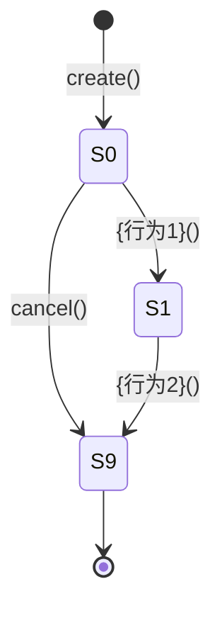

# 第二章：聚合设计

## 章节目标
完成聚合设计，包括：
1. **值对象设计**：先识别最简单的值对象
2. **实体设计**：在值对象基础上识别实体
3. **聚合根识别**：从实体中识别聚合根
4. **聚合边界确定**：确定聚合包含哪些成员
5. **聚合结构设计**：设计聚合的内部结构
6. **聚合根详细设计**：设计属性、状态、领域事件、行为
7. **聚合根用例设计**：设计聚合根行为测试用例

---

## 1. 聚合总览

### 1.1 聚合清单

| 聚合名称 | 聚合根 | 所属上下文 | 成员实体 | 成员值对象 |
|---------|-------|-----------|-----------------|-----------------|
| {聚合1} | {AR1} | {上下文A} | {实体1}, {实体2}... | {VO1}, {VO2}... |

### 1.2 聚合间关系图

```
{聚合根A} ──ID引用──> {聚合根B}
{聚合根C} ──事件────> {聚合根D}
```

### 1.3 聚合间引用

| 聚合 | 引用方式 | 目标聚合 | 引用类型 |
|------|---------|---------|---------|
| {聚合A} | ID 引用 | {聚合B} | 直接引用 |
| {聚合C} | 领域事件 | {聚合D} | 事件驱动 |

---

## 2. 每个聚合详细设计

### 2.1 {聚合1} 聚合详细设计

**聚合结构**

```
{聚合根}
├── {实体1}（实体）
│   └── {值对象1}（值对象）
└── {值对象2}（值对象）
```

**聚合成员**

| 成员名称 | 类型 | 说明 |
|---------|------|------|
| {聚合根} | 聚合根 | {说明} |
| {实体1} | 实体 | {说明} |
| {值对象1} | 值对象 | {说明} |

---

#### 2.1.1 聚合根：{聚合根名称}

**职责**：{简要描述聚合根的核心职责}

**唯一标识**：{标识字段名称}（{生成方式}）

**核心属性**

| 属性名 | 类型 | 说明 |
| ------ | ---- | ---- |
| {属性1} | {类型1} | {属性1说明} |
| {属性2} | {类型2} | {属性2说明} |

**状态定义**

| 状态码 | 状态名称 | 含义 | 可转移状态 |
| ------ | -------- | ---- | ---------- |
| {S0} | {状态1} | {状态1含义} | {可转移状态列表} |
| {S1} | {状态2} | {状态2含义} | {可转移状态列表} |

**状态转移图**



**领域事件**

| 事件名称 | 触发时机 | 携带数据 |
|---------|---------|---------|
| {事件1} | {时机} | {数据} |

**核心行为**

| 行为名称 | 参数 | 返回值 | 业务规则 | 领域事件   |
| -------- | ---- | ------ | -------- |--------|
| {行为1}() | {参数列表} | {返回类型} | {业务规则描述} | {领域事件} |

---

##### 2.1.1.1 行为：{行为1}

**方法签名**

```typescript
{方法名}(params: { {参数1}: {类型1}, {参数2}: {类型2} }): {返回类型}
```

**业务含义**：{行为的业务含义描述}

**前置条件**
- {前置条件1}
- {前置条件2}

**后置条件**
- 状态 = {新状态}
- {属性1} = params.{参数1}

**事件发布**（可选）
- 是否发布事件：[是/否]
- 发布的事件名称：{事件名称}
- 事件触发时机：{时机描述}
- 事件携带数据：
  - {字段1}: {类型1} - {说明}

**约束定义**

| 约束ID | 类型 | 描述 | 伪代码 | 执行时机 |
|-------|------|------|-------|---------|
| STR-{聚合缩写}-01 | 结构约束 | {约束描述} | `ASSERT {条件表达式}` | 创建时 |


#### 2.1.2 实体：{实体名称1}

**职责**：{简要描述实体的核心职责}

**唯一标识**：{标识字段名称}（{生成方式}）

**核心属性**

| 属性名 | 类型 | 说明 |
| ------ | ---- | ---- |
| {属性1} | {类型1} | {属性1说明} |

**核心行为**

| 行为名称 | 参数 | 返回值 | 业务规则 |
| -------- | ---- | ------ | -------- |
| {行为1}() | {参数列表} | {返回类型} | {业务规则描述} |

---

#### 2.1.3 值对象：{值对象名称1}

**职责**：{简要描述值对象的核心职责}

**核心属性**

| 属性名 | 类型 | 说明 |
| ------ | ---- | ---- |
| {属性1} | {类型1} | {属性1说明} |


---

### 2.2 {聚合2} 聚合详细设计
（内容结构同上）

---


## 3. 聚合根行为用例设计

### 3.1 聚合根：{聚合根1}

#### 3.1.1 行为：{行为 1}

**Case-{服务缩写}-N1: {正向场景}**

| Given | When | Then | 验证约束 |
|-------|------|------|---------|
| {前置条件} | {方法名}({参数}={值}) | {结果描述} | BIZ-{服务缩写}-01 ✓ |

**Case-{服务缩写}-B1: {约束违反场景}**

| Given | When | Then | 违反约束 |
|-------|------|------|---------|
| {前置条件} | {方法名}({参数}={非法值}) | 拒绝，"{错误信息}" | BIZ-{服务缩写}-01 ✗ |

**Case-{服务缩写}-E1: 边界场景**

| Given | When | Then | 验证约束 |
|-------|------|------|---------|
| {边界条件} | {方法名}({参数}={边界值}) | {结果描述} | BIZ-{服务缩写}-01 ✓ |


### 3.2 聚合根：{聚合根2}

#### 3.1.1 行为：{行为 1}

（内容结构同上）

