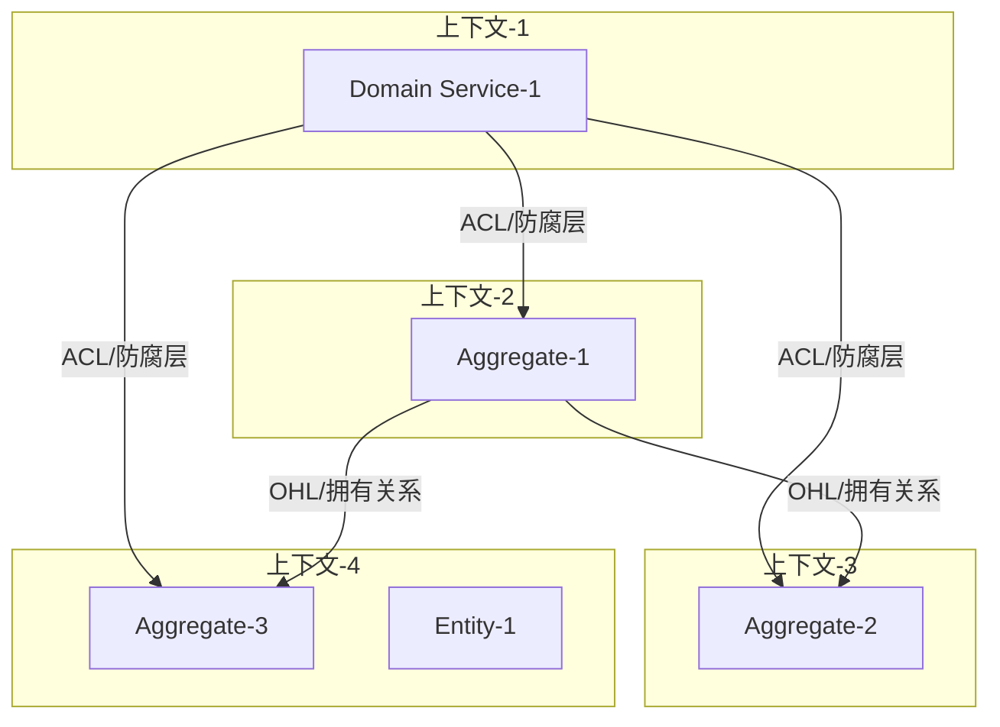
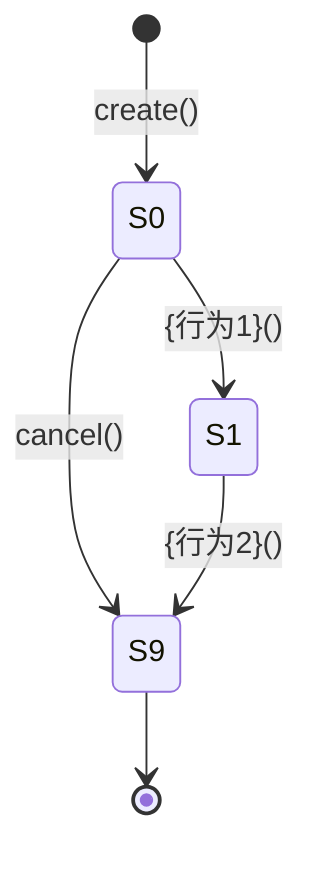
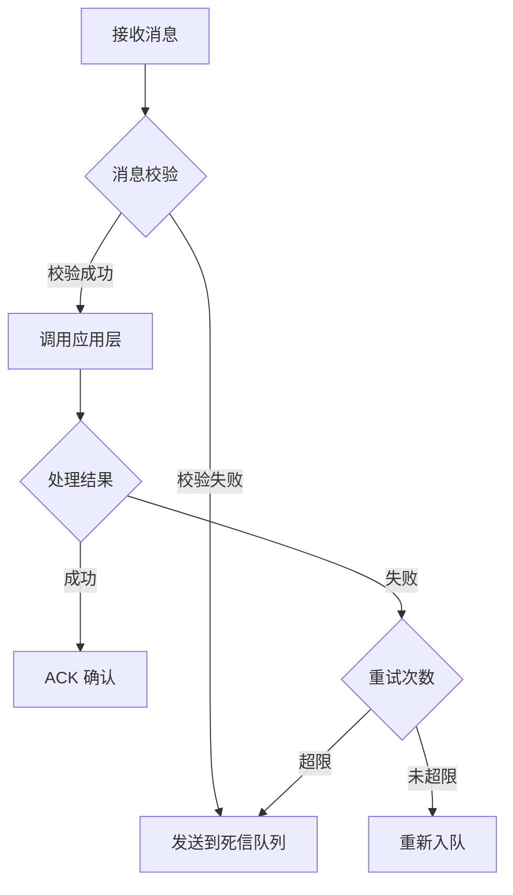
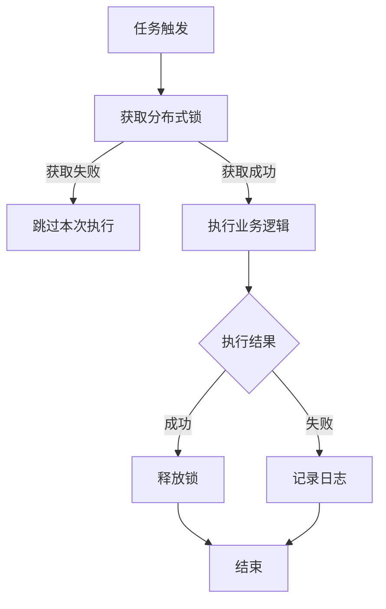

# {功能名称} - 领域设计文档

> **文档版本**：v1.0
> **创建时间**：{YYYY-MM-DD}

---

## 文档说明

本文档是领域架构师的核心产出物，整合了限界上下文、聚合、领域服务、应用层和入口层五个部分。

> **领域事件设计说明**：
> - 事件产生：参见第二章"聚合设计"中聚合根行为设计的"事件发布"字段
> - 事件消费：参见第四章"应用层设计"中的"事件处理"小节

### 核心原则

- **理论依据**：所有设计都有明确的理论支撑（DDD、状态机理论、不变量理论）
- **最佳实践**：符合业内公认的设计模式和规范
- **可验证性**：每个约束都可写成 assert，每个用例都可转化为测试

### 适用范围

本文档适用于以下架构类型：
- [ ] DDD 分层架构 Starter -> Application → Domain → Infra
---

## 一、限界上下文设计

> **目标**：识别业务核心能力，划分限界上下文，定义上下文间关系。

### 1. 业务能力分析

#### 1.1 业务能力树

```
{业务领域}
├── {一级能力1}
│   ├── {二级能力1.1}
│   └── {二级能力1.2}
└── {一级能力2}
    ├── {二级能力2.1}
    └── {二级能力2.2}
```

#### 1.2 能力分级

| 能力 | 类型 | 说明 | 战略重要性 |
|------|------|------|-----------|
| {能力1} | 核心域 | 差异化竞争力 | 高 |
| {能力2} | 支撑域 | 必要但非差异化 | 中 |
| {能力3} | 通用域 | 可外包/复用 | 低 |

#### 1.3 能力与团队对齐

| 能力 | 负责团队 | 上下游关系 |
|------|---------|-----------|
| {能力1} | {团队A} | 上游：{能力X}，下游：{能力Y} |

---

### 2. 限界上下文划分

#### 2.1 上下文识别

| 上下文名称 | 负责的业务能力 | 核心实体           | 上下文类型 |
|----------|--------------|-------------------|----------|
| {上下文1} | {能力描述}    | {实体1}<br> {实体2} | 核心域    |
| {上下文2} | {能力描述}    | {实体3}<br> {实体4} | 支撑域    |


---

### 3. 上下文映射

#### 3.1 上下文关系图



#### 3.2 集成模式定义

| 上游 | 下游 | 关系类型 | 集成模式 | 说明 |
|------|------|---------|---------|------|
| {上下文A} | {上下文B} | 上游下游 | O/C（上游/下游） | A 的变化影响 B |
| {上下文B} | {上下文C} | 独立 | ACL（防腐层） | C 通过防腐层调用 B |

#### 3.3 防腐层设计

| 防腐层位置 | 目标上下文 | 转换逻辑 |
|-----------|-----------|---------|
| {位置} | {上下文C} | 将 C 的 DTO 转换为本域的领域模型 |

---

## 二、聚合设计

> **目标**：在限界上下文内进行聚合设计，定义领域模型结构。

聚合总览

- 聚合清单

| 聚合名称 | 聚合根 | 聚合边界 | 一致性保证 |
|---------|--------|---------|-----------|
| {聚合1} | {聚合根实体} | 包含的实体/值对象 | {不变量描述} |

- 聚合间关系图

```
{聚合根}
├── {实体1}（实体）
│   └── {值对象1}（值对象）
└── {实体2}（实体）
```

- 聚合间引用

| 聚合 | 引用方式 | 目标聚合 | 引用类型 |
|------|---------|---------|---------|
| {聚合A} | ID 引用 | {聚合B} | 直接引用 |
| {聚合C} | 领域事件 | {聚合D} | 事件驱动 |

---

### 1. {聚合名称1} 聚合

> 聚合详细设计：每个聚合独立一个子章节，包含完整的结构、状态、行为设计。

聚合结构

**聚合成员**：

| 成员名称 | 类型 | 说明 |
|---------|------|------|
| {聚合根} | 聚合根 | {说明} |
| {实体1} | 实体 | {说明} |
| {值对象1} | 值对象 | {说明} |

**结构图**：

```
{聚合根}
├── {实体1}（实体）
│   └── {值对象1}（值对象）
└── {值对象2}（值对象）
```

#### 1.1 聚合根：{聚合根名称}

**聚合根**：{聚合根名称}

**职责**：{简要描述聚合根的核心职责和生命周期管理范围}

**唯一标识**：{标识字段名称}（{生成方式/规则}）

**{格式/结构定义}**：{格式说明}（如：{格式示例}）

**核心属性**：

| 属性名 | 类型 | 说明 |
| ------ | ---- | ---- |
| {属性1} | {类型1} | {属性1说明} |
| {属性2} | {类型2} | {属性2说明} |
| {属性3} | {类型3} | {属性3说明} |

**状态定义**：

| 状态码 | 状态名称 | 含义 | 可转移状态 |
| ------ | -------- | ---- | ---------- |
| {S0} | {状态1} | {状态1含义} | {可转移状态列表} |
| {S1} | {状态2} | {状态2含义} | {可转移状态列表} |
| {S2} | {状态3} | {状态3含义} | {可转移状态列表} |

**{聚合根名称} 状态转移图**：



**核心行为**：

| 行为名称 | 参数 | 返回值 | 业务规则 |
| -------- | ---- | ------ | -------- |
| {行为1}() | {参数列表} | {返回类型} | {业务规则描述} |
| {行为2}() | {参数列表} | {返回类型} | {业务规则描述} |
| {行为3}() | {参数列表} | {返回类型} | {业务规则描述} |


**{外部集成/扩展支持/行为策略/特殊算法/}**：

1. **{集成类型1}**：
    - {集成方式1}
    - {集成方式2}
2. **{集成类型2}**：
    - {集成方式1}
    - {集成方式2}

##### 行为设计：{行为1}

**方法签名**：
```typescript
create(params: { {参数1}: {类型1}, {参数2}: {类型2} }): {聚合根名称}
```

**业务含义**：{创建聚合的业务含义描述}

**前置条件**：
- {前置条件1}
- {前置条件2}

**后置条件**：
- 状态 = S0
- {属性1} = params.{参数1}

**事件发布**：
- 是否发布事件：[是/否]
- 发布的事件名称：{事件名称}（如果是）
- 事件触发时机：{时机描述，如"状态变更为 ACTIVE 后立即发布"}
- 事件携带数据：
  - {字段1}: {类型1} - {说明}
  - {字段2}: {类型2} - {说明}

**发布代码示例**（如果是）：
```typescript
// 在聚合根的行为方法中发布事件
{行为方法}(): void {
  // 1. 状态变更
  this.{状态} = {新状态}

  // 2. 发布事件（在状态变更成功后）
  this._events.push(new {事件名称}({
    eventId: uuid(),
    {字段1}: this.{字段1},
    {字段2}: this.{字段2},
    occurredAt: new Date()
  }))
}
```

**约束定义**：

| 约束ID | 类型 | 描述 | 伪代码 | 执行时机 |
|-------|------|------|-------|---------|
| STR-{聚合缩写}-01 | 结构约束 | {约束描述} | `ASSERT {条件表达式}` | 创建时 |
| STR-{聚合缩写}-02 | 结构约束 | {约束描述} | `ASSERT {条件表达式}` | 创建时 |

**用例设计**：

**Case-{聚合缩写}-01: 正向创建成功**

| Given | When | Then | 验证约束 |
|-------|------|------|---------|
| {前置状态} | create({参数}={值}) | {结果描述} | STR-{聚合缩写}-01 ✓ |


**Case-{聚合缩写}-B1: {约束违反场景}**

| Given | When | Then | 违反约束 |
|-------|------|------|---------|
| {前置状态} | create({参数}={非法值}) | 拒绝，"{错误信息}" | STR-{聚合缩写}-01 ✗ |

---

##### 行为设计：{行为2}

（同上结构，每个实体重复此模板）

---

#### 1.2 实体列表

| 实体名称 | 唯一标识 | 生命周期 | 状态 | 说明 |
|---------|---------|---------|------|------|
| {实体1} | {id字段} | {周期} | {状态} | {说明} |

##### 1.2.1 实体：{实体名称1}

**唯一标识**：{标识字段名称}（{生成方式}）

**类型**：{实体类型说明}（如：实体/不可变实体）

**职责**：{简要描述实体的核心职责和业务作用}

**核心属性**：

| 属性名 | 类型 | 说明 |
| ------ | ---- | ---- |
| {属性1} | {类型1} | {属性1说明} |
| {属性2} | {类型2} | {属性2说明} |
| {属性3} | {类型3} | {属性3说明} |

**状态定义**：

| 状态码 | 状态名称 | 业务含义 | 是否终态 | 允许的行为 |
|-------|---------|---------|---------|-----------|
| S0 | {初始状态} | {含义} | 否 | {行为1}, {行为2} |
| S1 | {中间状态} | {含义} | 否 | {行为3} |
| S9 | {终态} | {含义} | 是 | 无（只读） |

**状态转移图**：


**核心行为**：

| 行为名称 | 参数 | 返回值 | 业务规则 |
| -------- | ---- | ------ | -------- |
| {行为1}() | {参数列表} | {返回类型} | {业务规则描述} |
| {行为2}() | {参数列表} | {返回类型} | {业务规则描述} |


###### 行为设计：{行为1}

**方法签名**：
```typescript
create(params: { {参数1}: {类型1} }): {实体名称}
```

**业务含义**：{创建实体的业务含义描述}

**前置条件**：
- {前置条件1}

**后置条件**：
- 状态 = S0
- {属性1} = params.{参数1}

**约束定义**：

| 约束ID | 类型 | 描述 | 伪代码 | 执行时机 |
|-------|------|------|-------|---------|
| STR-{实体缩写}-01 | 结构约束 | {约束描述} | `ASSERT {条件表达式}` | 创建时 |

**用例设计**：

**Case-{实体缩写}-01: 正向创建成功**

| Given | When | Then | 验证约束 |
|-------|------|------|---------|
| {前置状态} | create({参数}={值}) | {结果描述} | STR-{实体缩写}-01 ✓ |

**Case-{实体缩写}-B1: {约束违反场景}**

| Given | When | Then | 违反约束 |
|-------|------|------|---------|
| {前置状态} | create({参数}={非法值}) | 拒绝，"{错误信息}" | STR-{实体缩写}-01 ✗ |


###### 行为设计：{行为2}

（同上结构，每个实体重复此模板）

##### 1.2.2 实体：{实体名称2} 

（同上结构，每个实体重复此模板）


#### 1.3 值对象列表

| 值对象名称 | 所属 | 属性 | 约束ID |
|-----------|------|------|--------|
| {值对象1} | {聚合根/实体} | {属性列表} | STR-{值对象缩写}-01 |

##### 1.3.1 值对象：{值对象名称}

**职责**：{简要描述值对象的核心职责和业务作用}

**核心属性**：

| 属性名 | 类型 | 说明 |
| ------ | ---- | ---- |
| {属性1} | {类型1} | {属性1说明} |
| {属性2} | {类型2} | {属性2说明} |
| {属性3} | {类型3} | {属性3说明} |

**约束定义**：

| 约束ID | 类型 | 描述 | 伪代码 | 执行时机 |
|-------|------|------|-------|---------|
| STR-{值对象缩写}-01 | 结构约束 | {约束描述} | `ASSERT {条件表达式}` | 创建时 |

**用例设计**：

**Case-{值对象缩写}-01: 正向创建成功**

| Given | When | Then | 验证约束 |
|-------|------|------|---------|
| - | {值对象名称}({参数}={值}) | {结果描述} | STR-{值对象缩写}-01 ✓ |

**Case-{值对象缩写}-B1: {约束违反场景}**

| Given | When | Then | 违反约束 |
|-------|------|------|---------|
| - | {值对象名称}({参数}={非法值}) | 拒绝，"{错误信息}" | STR-{值对象缩写}-01 ✗ |


##### 1.3.2 值对象：{值对象名称2}

（同上结构，每个值对象重复此模板）


---

### 2. {聚合名称2} 聚合

（同上结构，每个聚合重复此模板）

---


## 三、领域服务设计

> 领域服务的判断标准：
> - 涉及多个聚合根的协作
> - 不属于任何特定实体的行为
> - 需要访问领域外服务

领域服务列表

| 服务名称 | 职责 | 涉及的聚合 | 依赖 |
|---------|------|-----------|------|
| {服务1} | {职责描述} | {聚合A}, {聚合B} | {外部依赖} |

---

### 1. 领域服务:{服务1}

#### 1.1 方法：{方法名1}

**方法签名**：
```typescript
{方法名}(params: { {参数1}: {类型1} }): Promise<{返回类型}>
```

**职责**：{方法职责描述}

**前置条件**：
- {前置条件1}
- {前置条件2}

**后置条件**：
- {后置条件1}
- {后置条件2}

**约束定义**：

| 约束ID | 类型 | 描述 | 伪代码 | 执行时机 |
|-------|------|------|-------|---------|
| BIZ-DS-01 | 业务约束 | {约束描述} | `ASSERT {条件表达式}` | 执行时 |
| BIZ-DS-02 | 业务约束 | {约束描述} | `ASSERT {条件表达式}` | 执行时 |

**用例设计**：

**Case-DS-01: 正向执行成功**
| Given | When | Then | 验证约束 |
|-------|------|------|---------|
| {前置状态} | {方法名}({参数}={值}) | {结果描述} | BIZ-DS-01 ✓ |

**Case-DS-B1: {约束违反场景}**
| Given | When | Then | 违反约束 |
|-------|------|------|---------|
| {前置状态} | {方法名}({参数}={非法值}) | 拒绝，"{错误信息}" | BIZ-DS-01 ✗ |

---

#### 1.2 方法：{方法名2}

（同上结构，每个方法重复此模板）


---

### 2. 领域服务:{服务2}

（同上结构，每个领域服务重复此模板）


---


## 四、应用层设计

应用服务列表

| 服务名称 | 职责 | 涉及的聚合/领域服务 | 事务边界 |
|---------|------|-------------------|---------|
| {服务1} | {职责描述} | {聚合A}, {领域服务B} | {事务描述} |

---

### 1. 应用服务:{服务1}

> **关键区分**：行为分为用户行为 和系统行为

用户行为列表

| 行为名称 | 触发方 | 描述 | 影响的聚合 |
|---------|--------|------|-----------|
| {行为1} | 用户 | {描述} | {聚合} |
| {行为2} | 外部系统 | {描述} | {聚合} |

系统行为列表

| 行为名称 | 触发方式 | 描述 | 影响的聚合 | 实现方式 |
|---------|---------|------|-----------|---------|
| {行为1} | 定时任务 | {描述} | {聚合} | {定时器/事件} |
| {行为2} | 事件监听 | {描述} | {聚合} | {事件处理器} |

---

#### 1.1 方法：{方法名}(cmd)

**方法签名**：
```typescript
{方法名}(cmd: { {参数1}: {类型1} }): Promise<{返回类型}>
```

**职责**：{用例编排描述}

**前置条件**：
- {前置条件1}
- {前置条件2}

**后置条件**：
- {后置条件1}
- {后置条件2}

**约束定义**：

| 约束ID | 类型 | 描述 | 伪代码 | 执行时机 |
|-------|------|------|-------|---------|
| BIZ-APP-01 | 业务约束 | {约束描述} | `ASSERT {条件表达式}` | 执行时 |
| BIZ-APP-02 | 业务约束 | {约束描述} | `ASSERT {条件表达式}` | 执行时 |

**用例设计**：

**Case-APP-01: 正向执行成功**
| Given | When | Then | 验证约束 |
|-------|------|------|---------|
| {前置状态} | {方法名}({参数}={值}) | {结果描述} | BIZ-APP-01 ✓ |

**Case-APP-B1: {约束违反场景}**
| Given | When | Then | 违反约束 |
|-------|------|------|---------|
| {前置状态} | {方法名}({参数}={非法值}) | 拒绝，"{错误信息}" | BIZ-APP-01 ✗ |

**Case-APP-E1: 边界场景**
| Given | When | Then | 验证约束 |
|-------|------|------|---------|
| {边界条件} | {方法名}({参数}={边界值}) | {结果描述} | BIZ-APP-01 ✓ |

---

#### 1.2 方法：{方法名2}(cmd)

（同上结构，每个方法重复此模板）


### 2. 应用服务:{服务2}

（同上结构，每个应用服务重复此模板）

---


## 五、入口层设计

> **目标**：定义外部系统与领域层的交互入口，包括 HTTP 接口、消息队列和定时任务。

> **核心原则**：
> - **薄入口层**：入口层仅负责参数校验、调用应用层、返回结果，不包含业务逻辑
> - **统一响应格式**：所有接口返回统一的响应结构
> - **异常处理**：统一的异常处理和错误码映射

---

### 1. Controller 层（HTTP 入口）

> - **职责**：接收 HTTP 请求，参数校验，调用应用层，返回响应。
> - **原则**：Controller只允许有 post 接口，不允许其他接口。

Controller 总览

| Controller 名称 | 职责 | 对应应用服务 | 路由前缀 |
|----------------|------|------------|---------|
| {Controller1} | {职责描述} | {应用服务1} | /{prefix} |

---

#### 1.1 Controller：{Controller 名称}

> Controller 详细设计：每个 Controller 独立一个子章节。

**路由前缀**：`/{前缀}`

**职责**：{简要描述 Controller 的核心职责}

**对应应用服务**：{应用服务名称}

**接口列表**：

| 接口名称 | HTTP 方法 | 路径 | 应用层方法 | 说明 |
|---------|----------|------|-----------|------|
| {接口1} | POST | /{path} | {应用方法} | {说明} |
| {接口2} | POST | /{path} | {应用方法} | {说明} |
| {接口3} | POST | /{path} | {应用方法} | {说明} |
| {接口4} | POST | /{path} | {应用方法} | {说明} |

---

##### 接口设计：{接口1}

**基本信息**

| 字段 | 值 |
|------|-----|
| 接口名称 | {接口名称} |
| HTTP 方法 | POST |
| 路径 | /{path} |
| 应用层方法 | {应用服务}.{方法名} |
| 描述 | {接口描述} |

**请求定义**

**请求头**：

| 字段名 | 类型 | 必填 | 说明 |
|-------|------|------|------|
| Content-Type | string | 是 | application/json |
| Authorization | string | 是 | Bearer {token} |

**请求参数（Request Body）**：

| 字段名 | 类型 | 必填 | 约束 | 说明 |
|-------|------|------|------|------|
| {字段1} | {类型} | 是 | {约束规则} | {字段说明} |
| {字段2} | {类型} | 否 | {约束规则} | {字段说明} |

**请求示例**：

```json
{
  "{字段1}": "{值1}",
  "{字段2}": "{值2}"
}
```

**响应定义**

**响应结构**：

```typescript
interface ApiResponse<T> {
  code: number          // 业务状态码
  message: string       // 响应消息
  data?: T             // 业务数据
}
```

**成功响应（200 OK）**：

| 字段名 | 类型 | 说明 |
|-------|------|------|
| code | number | 200（表示业务成功） |
| message | string | "{成功消息}" |
| data | {数据类型} | {数据说明} |

**成功响应示例**：

```json
{
  "code": 200,
  "message": "{成功消息}",
  "data": {
    "{字段1}": "{值1}"
  }
}
```

**失败响应**：

| HTTP 状态码 | code 字段 | 场景 | 说明 |
|------------|----------|------|------|
| 400 | 40001 | 参数校验失败 | 请求参数不符合约束 |
| 401 | 40101 | 未认证 | 缺少或无效的认证信息 |
| 403 | 40301 | 无权限 | 已认证但无权访问 |
| 404 | 40401 | 资源不存在 | 请求的资源不存在 |
| 409 | 40901 | 状态冲突 | 业务状态不允许当前操作 |
| 500 | 50001 | 系统错误 | 服务器内部错误 |

**失败响应示例**：

```json
{
  "code": 40001,
  "message": "{错误信息}"
}
```

**业务约束映射**：

| 应用层约束 | HTTP 状态码 | code 字段 | 错误消息 |
|-----------|------------|----------|---------|
| BIZ-APP-01 | 409 | 40901 | "{约束违反消息}" |
| BIZ-APP-02 | 400 | 40001 | "{约束违反消息}" |

**异常处理**：

| 异常类型 | HTTP 状态码 | 处理方式 |
|---------|------------|---------|
| {异常1} | 400 | 记录日志，返回 {错误信息} |
| {异常2} | 500 | 记录日志，返回通用错误信息 |

---

##### 接口设计：{接口2}

（同上结构，每个接口重复此模板）

---

#### 1.2 Controller：{Controller 名称2}

（同上结构，每个 Controller 重复此模板）

---

### 2. MQ 层（消息队列入口）

> **职责**：监听消息队列消息，调用应用层处理业务。

MQ 总览

| 消费者名称 | 订阅主题/队列 | 职责 | 对应应用服务 | 并发数 |
|-----------|-------------|------|------------|-------|
| {消费者1} | {topic/queue} | {职责描述} | {应用服务1} | {并发数} |

---

#### 2.1 消费者：{消费者名称}

> 消费者详细设计：每个消费者独立一个子章节。

**基本信息**

| 字段 | 值 |
|------|-----|
| 消费者名称 | {消费者名称} |
| 订阅主题/队列 | {topic/queue} |
| 订阅模式 | {订阅模式：广播/集群} |
| 并发数 | {并发消费者数量} |
| 对应应用服务 | {应用服务}.{方法名} |
| 描述 | {消费者描述} |

**消息定义**

**消息结构**：

```typescript
interface {消息名称} {
  {字段1}: {类型1}    // {字段说明}
  {字段2}: {类型2}    // {字段说明}
}
```

**消息示例**：

```json
{
  "{字段1}": "{值1}",
  "{字段2}": "{值2}"
}
```

**消息约束**：

| 约束ID | 类型 | 描述 | 验证方式 |
|-------|------|------|---------|
| STR-MQ-{消费者缩写}-01 | 结构约束 | {约束描述} | {验证方式} |

**处理逻辑**

**流程图**：



**处理步骤**：

1. **消息接收**：从 {topic/queue} 接收消息
2. **参数校验**：
   - 校验 {字段1} 不为空
   - 校验 {字段2} 符合格式
3. **调用应用层**：调用 {应用服务}.{方法名}({参数})
4. **结果处理**：
   - 成功：ACK 确认
   - 失败：重新入队（最多 {重试次数} 次）
   - 超过重试次数：发送到死信队列

**异常处理**：

| 异常类型 | 处理方式 | 是否重试 |
|---------|---------|---------|
| {异常1} | {处理方式} | 是 |
| {异常2} | 发送到死信队列，告警 | 否 |

**幂等性保证**：

| 幂等键 | 存储位置 | 说明 |
|-------|---------|------|
| {幂等键字段} | {存储位置} | 通过 {幂等键} 去重，避免重复消费 |

---

#### 2.2 消费者：{消费者名称2}

（同上结构，每个消费者重复此模板）

---

### 3. Task 层（定时任务入口）

> **职责**：按计划执行定时任务，调用应用层处理业务。

Task 总览

| 任务名称 | 调度策略 | 职责 | 对应应用服务 |
|---------|---------|------|------------|
| {任务1} | {Cron 表达式} | {职责描述} | {应用服务1} |

---

#### 3.1 任务：{任务名称}

> 任务详细设计：每个任务独立一个子章节。

**基本信息**

| 字段 | 值 |
|------|-----|
| 任务名称 | {任务名称} |
| 调度策略 | {Cron 表达式或固定间隔} |
| 执行超时 | {超时时间} |
| 对应应用服务 | {应用服务}.{方法名} |
| 描述 | {任务描述} |

**执行逻辑**

**流程图**：



**执行步骤**：

1. **任务触发**：按 {Cron 表达式} 定时触发
2. **分布式锁**：
   - 锁键：{lock:task:{任务名称}}
   - 锁超时：{锁超时时间}
   - 获取失败则跳过本次执行
3. **调用应用层**：调用 {应用服务}.{方法名}({参数})
4. **结果处理**：
   - 成功：记录成功日志
   - 失败：记录失败日志，发送告警

**任务参数**：

| 参数名 | 类型 | 说明 |
|-------|------|------|
| {参数1} | {类型} | {参数说明} |
| {参数2} | {类型} | {参数说明} |

**异常处理**：

| 异常类型 | 处理方式 | 是否告警 |
|---------|---------|---------|
| {异常1} | 记录日志，释放锁 | 是 |
| {异常2} | 记录日志，释放锁 | 否 |

**执行监控**：

| 监控指标 | 阈值 | 告警方式 |
|---------|------|---------|
| 执行耗时 | {阈值} | {告警方式} |
| 失败次数 | {阈值} | {告警方式} |

**数据分片**（适用于批量处理）：

| 分片策略 | 分片键 | 说明 |
|---------|-------|------|
| {策略} | {分片键} | {说明} |

---

#### 3.2 任务：{任务名称2}

（同上结构，每个任务重复此模板）

---

**文档结束**
