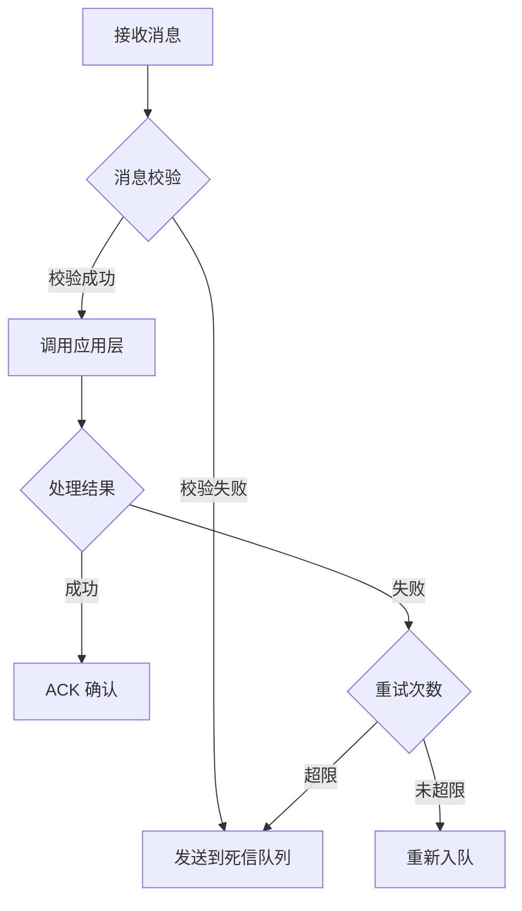
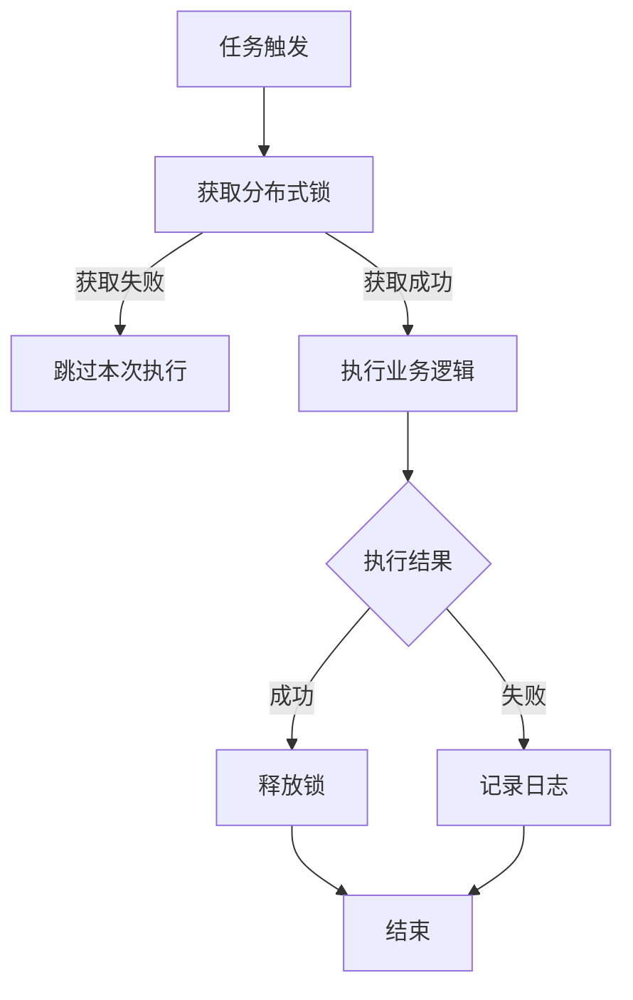

# 第五章：入口层设计（Starter 层）

## 章节目标

完成入口层（Starter 层）设计，包括：
1. **Controller 层**：定义 HTTP 接口入口
2. **MQ 层**：定义消息队列消费者
3. **Task 层**：定义定时任务

---

## 核心原则

- **薄入口层**：入口层仅负责参数校验、调用应用层、返回结果，不包含业务逻辑
- **统一响应格式**：所有接口返回统一的响应结构
- **异常处理**：统一的异常处理和错误码映射

---

## 输入来源

从 PRD 和第四章中提取以下信息：

| 来源 | 提取内容 | 转化目标 |
|------|---------|---------|
| PRD API 需求 | HTTP 接口 | Controller 设计 |
| PRD 消息队列 | MQ 消费 | MQ 消费者设计 |
| PRD 定时任务 | 定时任务 | Task 设计 |
| 第四章 应用层 | 应用服务 | 入口调用目标 |

---

## 生成步骤

### Part 1：Controller 层（HTTP 入口）

#### Step 1.1：Controller 总览

**目标**：列出所有 Controller。

| Controller 名称 | 职责 | 对应应用服务 | 路由前缀 |
|----------------|------|------------|---------|
| {Controller1} | {职责描述} | {应用服务1} | /{prefix} |

**Controller 命名规范**：
```
格式：{聚合名} + Controller

示例：
✅ 好的命名
- MembershipController
- CouponController
- PaymentController

❌ 差的命名
- MembershipService（与 Service 层混淆）
- MembershipHandler（不明确）
```

---

#### Step 1.2：Controller 详细设计

**基本信息**

| 字段 | 值 |
|------|-----|
| Controller 名称 | {Controller 名称} |
| 路由前缀 | `/{前缀}` |
| 职责 | {职责描述} |
| 对应应用服务 | {应用服务名称} |

**接口列表**

| 接口名称 | HTTP 方法 | 路径 | 应用层方法 | 说明 |
|---------|----------|------|-----------|------|
| {接口1} | POST | /{path} | {应用方法} | {说明} |
| {接口2} | POST | /{path} | {应用方法} | {说明} |

**接口设计原则**：
- **只允许 POST 接口**：所有接口都是 POST，其他方法（GET、PUT、DELETE）不使用
- **统一路径格式**：使用 `/api/版本/端/聚合名/动作` 格式

**接口路径格式**：

```
/api/{版本}/{端}/{聚合名}/{动作}
```

**路径组成部分**：

| 组成部分 | 说明 | 取值 |
|---------|------|------|
| **api** | 固定前缀 | `api` |
| **版本** | 接口版本 | `v1`, `v2`, `v3` ... |
| **端** | 调用端标识 | `m`（mobile 移动端）, `c`（client 客户端）, `w`（web 网页端）, `a`（admin 管理端） |
| **聚合名** | 聚合根名称 | `wallet`, `user`, `membership`, `order` ... |
| **动作** | 操作动作 | `freeze`, `login`, `create`, `cancel` ... |

**端标识定义**：

| 端标识 | 名称 | 说明 |
|-------|------|------|
| **m** | Mobile | 移动端（iOS/Android App） |
| **c** | Client | 客户端（通用） |
| **w** | Web | 网页端（浏览器） |
| **a** | Admin | 管理端（后台） |

**路径示例**：

```
✅ 好的路径设计
POST /api/v1/m/wallet/freeze        // 移动端：冻结钱包
POST /api/v1/c/user/login           // 客户端：用户登录
POST /api/v1/m/membership/create    // 移动端：创建会员
POST /api/v1/a/order/cancel         // 管理端：取消订单
POST /api/v2/w/payment/query        // 网页端：查询支付（v2 版本）

❌ 差的路径设计
GET /api/wallet/freeze              // 不使用 GET
POST /api/wallet/freeze             // 缺少版本号
POST /api/v1/wallet/freeze          // 缺少端标识
POST /wallet/freeze                 // 缺少前缀
POST /api/v1/m/freezeWallet         // 动作使用驼峰，应使用小写
```

**路径命名规范**：

| 规范 | 说明 | 示例 |
|------|------|------|
| **全小写** | 所有路径使用小写 | `wallet`, `freeze`, `login` |
| **连字符分隔** | 多词使用连字符 | `daily-grant`, `expire-check` |
| **动词结尾** | 动作使用动词 | `create`, `cancel`, `freeze`, `login` |

---

#### Step 1.3：接口设计

**基本信息**

| 字段 | 值 |
|------|-----|
| 接口名称 | {接口名称} |
| HTTP 方法 | POST |
| 路径 | /{path} |
| 应用层方法 | {应用服务}.{方法名} |
| 描述 | {接口描述} |

**请求定义**

**请求头**：

| 字段名 | 类型 | 必填 | 说明 |
|-------|------|------|------|
| Content-Type | string | 是 | application/json |
| Authorization | string | 是 | Bearer {token} |

**请求参数（Request Body）**：

**参数命名格式**：

```
格式：{动作} + {聚合名} + Param

示例：
✅ 好的参数命名
- CreateMembershipParam（创建会员）
- FreezeWalletParam（冻结钱包）
- CancelOrderParam（取消订单）
- LoginUserParam（用户登录）

❌ 差的参数命名
- CreateMembershipRequest（不是 Request，是 Param）
- MembershipDTO（DTO 是响应对象，不是请求参数）
- CreateMembershipReq（缩写不规范）
```

**禁止使用原始数据类型**：

**原则**：所有接口参数必须是对象类型，不能使用原始数据类型（string, number, boolean 等）。

```typescript
// ✅ 正确：使用 Param 对象
@Post("/api/v1/m/wallet/freeze")
async freezeWallet(@Body() param: FreezeWalletParam): Promise<ApiResponse<void>> {
  // param 是对象类型
}

interface FreezeWalletParam {
  walletId: string
  reason: string
}

// ❌ 错误：使用原始数据类型
@Post("/api/v1/m/wallet/freeze")
async freezeWallet(@Body() walletId: string): Promise<ApiResponse<void>> {
  // 不应该直接使用 string
}

// ❌ 错误：使用多个原始类型参数
@Post("/api/v1/m/user/login")
async login(
  @Body() username: string,
  @Body() password: string
): Promise<ApiResponse<LoginDTO>> {
  // 不应该使用多个原始类型参数
}

// ✅ 正确：包装成 Param 对象
@Post("/api/v1/m/user/login")
async login(@Body() param: LoginUserParam): Promise<ApiResponse<LoginDTO>> {
  // param 是对象类型
}

interface LoginUserParam {
  username: string
  password: string
}
```

**参数字段定义**：

| 字段名 | 类型 | 必填 | 约束 | 说明 |
|-------|------|------|------|------|
| {字段1} | {类型} | 是 | {约束规则} | {字段说明} |
| {字段2} | {类型} | 否 | {约束规则} | {字段说明} |

**参数对象设计原则**：
- **只包含输入字段**：Param 只包含用户输入的字段
- **不包含业务规则**：业务规则字段（如 status、isActive）应该在领域层
- **不包含计算字段**：计算得出的字段不应该在 Param 中

**请求示例**：

```json
{
  "{字段1}": "{值1}",
  "{字段2}": "{值2}"
}
```

**响应定义**

**响应结构**：

```typescript
interface ApiResponse<T> {
  code: number          // 业务状态码
  message: string       // 响应消息
  data?: T             // 业务数据
}
```

**成功响应（200 OK）**：

| 字段名 | 类型 | 说明 |
|-------|------|------|
| code | number | 200（表示业务成功） |
| message | string | "{成功消息}" |
| data | object | {业务数据} |

**失败响应（200 OK，但 code ≠ 200）**：

| 字段名 | 类型 | 说明 |
|-------|------|------|
| code | number | 400（参数错误）、500（系统错误） |
| message | string | "{错误信息}" |
| data | null | - |

**异常处理**

| 异常类型 | HTTP 状态码 | 业务状态码 | 错误信息 |
|---------|-----------|-----------|---------|
| 参数校验失败 | 200 | 400 | "参数错误：{详细说明}" |
| 权限不足 | 200 | 403 | "权限不足" |
| 业务规则违反 | 200 | 422 | "{业务错误信息}" |
| 系统错误 | 200 | 500 | "系统错误，请稍后重试" |

---

### Part 2：MQ 层（消息队列入口）

#### Step 2.1：MQ 总览

**目标**：列出所有 MQ 消费者。

| 消费者名称 | 订阅主题 | 职责 | 对应应用服务 |
|-----------|---------|------|------------|
| {消费者1} | {topic/queue} | {职责描述} | {应用服务1} |

---

#### Step 2.2：消费者详细设计

**基本信息**

| 字段 | 值 |
|------|-----|
| 消费者名称 | {消费者名称} |
| 订阅主题 | {topic/queue} |
| 职责 | {职责描述} |
| 对应应用服务 | {应用服务}.{方法名} |

**消息定义**

**消息结构**：

```typescript
interface {消息名称} {
  {字段1}: {类型1}
  {字段2}: {类型2}
}
```

**消息字段**：

| 字段名 | 类型 | 必填 | 说明 |
|-------|------|------|------|
| {字段1} | {类型} | 是 | {字段说明} |
| {字段2} | {类型} | 是 | {字段说明} |

**消息示例**：

```json
{
  "{字段1}": "{值1}",
  "{字段2}": "{值2}"
}
```

**消息约束**：

| 约束ID | 类型 | 描述 | 验证方式 |
|-------|------|------|---------|
| STR-MQ-{消费者缩写}-01 | 结构约束 | {约束描述} | {验证方式} |

**处理逻辑**

**流程图**：



**处理步骤**：

1. **消息接收**：从 {topic/queue} 接收消息
2. **参数校验**：
   - 校验 {字段1} 不为空
   - 校验 {字段2} 符合格式
3. **调用应用层**：调用 {应用服务}.{方法名}({参数})
4. **结果处理**：
   - 成功：ACK 确认
   - 失败：重新入队（最多 {重试次数} 次）
   - 超过重试次数：发送到死信队列

**异常处理**：

| 异常类型 | 处理方式 | 是否重试 |
|---------|---------|---------|
| {异常1} | {处理方式} | 是 |
| {异常2} | 发送到死信队列，告警 | 否 |

**幂等性保证**：

| 幂等键 | 存储位置 | 说明 |
|-------|---------|------|
| {幂等键字段} | {存储位置} | 通过 {幂等键} 去重，避免重复消费 |

---

### Part 3：Task 层（定时任务入口）

#### Step 3.1：Task 总览

**目标**：列出所有定时任务。

| 任务名称 | 调度策略 | 职责 | 对应应用服务 |
|---------|---------|------|------------|
| {任务1} | {Cron 表达式} | {职责描述} | {应用服务1} |

---

#### Step 3.2：任务详细设计

**基本信息**

| 字段 | 值 |
|------|-----|
| 任务名称 | {任务名称} |
| 调度策略 | {Cron 表达式或固定间隔} |
| 执行超时 | {超时时间} |
| 对应应用服务 | {应用服务}.{方法名} |
| 描述 | {任务描述} |

**执行逻辑**

**流程图**：



**执行步骤**：

1. **任务触发**：按 {Cron 表达式} 定时触发
2. **分布式锁**：
   - 锁键：{lock:task:{任务名称}}
   - 锁超时：{锁超时时间}
   - 获取失败则跳过本次执行
3. **调用应用层**：调用 {应用服务}.{方法名}({参数})
4. **结果处理**：
   - 成功：记录成功日志
   - 失败：记录失败日志，发送告警

**任务参数**：

| 参数名 | 类型 | 说明 |
|-------|------|------|
| {参数1} | {类型} | {参数说明} |
| {参数2} | {类型} | {参数说明} |

**异常处理**：

| 异常类型 | 处理方式 | 是否告警 |
|---------|---------|---------|
| {异常1} | 记录日志，释放锁 | 是 |
| {异常2} | 记录日志，释放锁 | 否 |

**执行监控**：

| 监控指标 | 阈值 | 告警方式 |
|---------|------|---------|
| 执行耗时 | {阈值} | {告警方式} |
| 失败次数 | {阈值} | {告警方式} |

**数据分片**（适用于批量处理）：

| 分片策略 | 分片键 | 说明 |
|---------|-------|------|
| {策略} | {分片键} | {说明} |

---

## 输出格式

### 1. Controller 层

#### 1.1 Controller 总览

| Controller 名称 | 职责 | 对应应用服务 | 路由前缀 |
|----------------|------|------------|---------|
| {Controller1} | {职责描述} | {应用服务1} | /{prefix} |

---

#### 1.2 Controller：{Controller 名称}

**基本信息**

| 字段 | 值 |
|------|-----|
| Controller 名称 | {Controller 名称} |
| 路由前缀 | `/{前缀}` |
| 职责 | {职责描述} |
| 对应应用服务 | {应用服务名称} |

**接口列表**

| 接口名称 | HTTP 方法 | 路径 | 应用层方法 | 说明 |
|---------|----------|------|-----------|------|
| {接口1} | POST | /{path} | {应用方法} | {说明} |
| {接口2} | POST | /{path} | {应用方法} | {说明} |

---

##### 接口设计：{接口1}

**基本信息**

| 字段 | 值 |
|------|-----|
| 接口名称 | {接口名称} |
| HTTP 方法 | POST |
| 路径 | /{path} |
| 应用层方法 | {应用服务}.{方法名} |
| 描述 | {接口描述} |

**请求定义**

**请求头**：

| 字段名 | 类型 | 必填 | 说明 |
|-------|------|------|------|
| Content-Type | string | 是 | application/json |
| Authorization | string | 是 | Bearer {token} |

**请求参数（Request Body）**：

**参数命名格式**：`{动作} + {聚合名} + Param`

**禁止使用原始数据类型**：所有接口参数必须是对象类型，不能使用原始数据类型（string, number, boolean 等）。

| 字段名 | 类型 | 必填 | 约束 | 说明 |
|-------|------|------|------|------|
| {字段1} | {类型} | 是 | {约束规则} | {字段说明} |
| {字段2} | {类型} | 否 | {约束规则} | {字段说明} |

**请求示例**：

```json
{
  "{字段1}": "{值1}",
  "{字段2}": "{值2}"
}
```

**响应定义**

**成功响应（200 OK）**：

```json
{
  "code": 200,
  "message": "{成功消息}",
  "data": {
    "{字段1}": "{值1}"
  }
}
```

**失败响应（200 OK，但 code ≠ 200）**：

```json
{
  "code": 400,
  "message": "{错误信息}",
  "data": null
}
```

---

### 2. MQ 层

#### 2.1 MQ 总览

| 消费者名称 | 订阅主题 | 职责 | 对应应用服务 |
|-----------|---------|------|------------|
| {消费者1} | {topic/queue} | {职责描述} | {应用服务1} |

---

#### 2.2 消费者：{消费者名称}

**基本信息**

| 字段 | 值 |
|------|-----|
| 消费者名称 | {消费者名称} |
| 订阅主题 | {topic/queue} |
| 职责 | {职责描述} |
| 对应应用服务 | {应用服务}.{方法名} |

**消息定义**

**消息结构**：

```json
{
  "{字段1}": "{值1}",
  "{字段2}": "{值2}"
}
```

**处理逻辑**


---

### 3. Task 层

#### 3.1 Task 总览

| 任务名称 | 调度策略 | 职责 | 对应应用服务 |
|---------|---------|------|------------|
| {任务1} | {Cron 表达式} | {职责描述} | {应用服务1} |

---

#### 3.2 任务：{任务名称}

**基本信息**

| 字段 | 值 |
|------|-----|
| 任务名称 | {任务名称} |
| 调度策略 | {Cron 表达式或固定间隔} |
| 执行超时 | {超时时间} |
| 对应应用服务 | {应用服务}.{方法名} |

**执行逻辑**


---

## 质量检查

完成本章后，使用以下检查清单自检：

### 1. 入口层核心原则

#### 薄入口层
- [ ] 入口层仅负责参数校验、调用应用层、返回结果
  - 不包含业务逻辑
  - 业务逻辑在应用层和领域层

#### 统一响应格式
- [ ] 所有接口返回统一的响应结构
  ```typescript
  interface ApiResponse<T> {
    code: number          // 业务状态码
    message: string       // 响应消息
    data?: T             // 业务数据
  }
  ```

#### 异常处理
- [ ] 统一的异常处理和错误码映射
  - 参数校验失败：业务状态码 400
  - 权限不足：业务状态码 403
  - 业务规则违反：业务状态码 422
  - 系统错误：业务状态码 500

---

### 2. Controller 层设计

#### 只允许 POST
- [ ] Controller 只允许 POST 接口
  - 不使用 GET、PUT、DELETE
  - 原因：POST 语义清晰，统一风格

#### 接口路径设计
- [ ] 路径设计符合规范
  - 格式：/api/版本/端/聚合名/动作
  - 全小写：wallet、freeze、login
  - 连字符分隔：daily-grant、expire-check
  - 动词结尾：create、cancel、freeze、login

#### 端标识
- [ ] 端标识使用正确
  - m（Mobile）：移动端（iOS/Android App）
  - c（Client）：客户端（通用）
  - w（Web）：网页端（浏览器）
  - a（Admin）：管理端（后台）

#### Controller 命名
- [ ] Controller 命名符合规范
  - 格式：聚合名 + Controller
  - 示例：MembershipController、CouponController、PaymentController

#### 接口完整性
- [ ] 所有 Controller 已识别
- [ ] 所有接口都有请求定义
- [ ] 所有接口都有响应定义
- [ ] 所有接口都有异常处理
- [ ] 响应格式统一

---

### 3. 请求参数设计

#### 参数命名
- [ ] 参数命名符合规范
  - 格式：{动作} + {聚合名} + Param
  - 示例：CreateMembershipParam、FreezeWalletParam、CancelOrderParam

#### 禁止原始类型
- [ ] 不使用原始数据类型
  - 不直接使用 string、number、boolean
  - 所有参数必须是对象类型

#### Request Body
- [ ] 使用 Request Body 传递参数
  - 不使用 URL 参数
  - 不使用多个原始类型参数

#### 参数对象设计
- [ ] 参数对象只包含输入字段
  - 不包含业务规则
  - 不包含派生字段

---

### 4. MQ 层设计

#### 消费者设计
- [ ] 消费者只负责接收消息、调用应用层、确认消息
  - 不包含业务逻辑
  - 业务逻辑在应用层

#### 幂等性
- [ ] 消费者保证幂等性
  - 使用 eventId 作为幂等键
  - 处理前检查是否已处理

#### 异常处理
- [ ] 消费者异常处理正确
  - 参数错误：发送到死信队列，告警，不重试
  - 业务错误：发送到死信队列，告警，不重试
  - 系统错误：重新入队（最多 N 次），重试
  - 超过重试次数：发送到死信队列，告警，不重试

#### 消费者完整性
- [ ] 所有消费者已识别
- [ ] 每个消费者都有消息定义
- [ ] 每个消费者都有处理逻辑

---

### 5. Task 层设计

#### 定时任务设计
- [ ] 定时任务只负责触发、调用应用层、记录日志
  - 不包含业务逻辑
  - 业务逻辑在应用层

#### 分布式锁
- [ ] 定时任务使用分布式锁
  - 获取锁：执行任务
  - 获取失败：跳过本次执行
  - 锁超时：设置合理的超时时间

#### 任务监控
- [ ] 定时任务有监控指标
  - 执行耗时：> 30 秒告警
  - 失败次数：> 3 次/天告警
  - 跳过次数：> 10 次/天告警

#### 任务完整性
- [ ] 所有任务已识别
- [ ] 每个任务都有调度策略
- [ ] 每个任务都有执行逻辑
- [ ] 每个任务都有分布式锁
- [ ] 每个任务都有异常处理
- [ ] 每个任务都有监控指标

---

### 6. 数据模型转换

#### DTO 使用
- [ ] 入口层使用 DTO，不直接使用领域模型
  - Request → Command
  - Domain → DTO
  - 不直接暴露领域模型

#### 参数校验分层
- [ ] 参数校验分层清晰
  - 入口层：格式校验（邮箱格式、手机号格式）
  - 入口层：参数校验（必填字段、数值范围）
  - 领域层：业务规则校验（会员只能有一个生效订阅）

---

### 7. 接口文档

#### 文档完整性
- [ ] 每个接口有完整的文档
  - 接口名称：清晰的接口名称
  - 接口描述：接口的业务含义
  - 请求定义：Request Header、Request Body
  - 响应定义：成功响应、失败响应
  - 请求示例：JSON 示例
  - 响应示例：JSON 示例
  - 错误码：所有可能的错误码

#### 版本控制
- [ ] 接口使用路径版本控制
  - 格式：/api/v1/、/api/v2/
  - 不使用查询参数版本控制

---

## 常见问题

### Q1: Controller 只允许 POST 接口吗？

**是的**。根据架构规范，Controller 只允许 POST 接口。

**原因**：
- POST 语义清晰：表示执行操作
- 统一风格：所有接口都是 POST
- 避免歧义：GET、PUT、DELETE 语义容易混淆

### Q2: MQ 消费者如何保证幂等性？

**方法**：
1. **幂等键**：为每个消息定义幂等键
2. **去重表**：记录已处理的消息幂等键
3. **检查顺序**：先检查是否已处理，再处理消息

```typescript
class CouponConsumer {
  async onMembershipActivated(event: MembershipActivated): Promise<void> {
    // 幂等性检查
    const idempotentKey = `membership:activated:${event.eventId}`
    const exists = await this.idempotentRepo.exists(idempotentKey)
    if (exists) {
      return  // 已处理，直接返回
    }

    // 处理消息
    await this.couponService.startDailyGrant(event.membershipId)

    // 记录已处理
    await this.idempotentRepo.save(idempotentKey)
  }
}
```

### Q3: Task 如何避免重复执行？

**方法**：使用分布式锁

```typescript
class ExpireMembershipTask {
  async execute(): Promise<void> {
    // 获取分布式锁
    const lock = await this.lockManager.acquire(
      `lock:task:expire-membership`,
      { timeout: 30000 }  // 锁超时 30 秒
    )

    if (!lock) {
      return  // 获取失败，跳过本次执行
    }

    try {
      // 执行业务逻辑
      await this.membershipService.expireMemberships()
    } finally {
      // 释放锁
      await lock.release()
    }
  }
}
```
