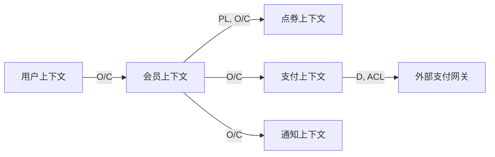

# DDD 战略设计模式

## 概述

DDD 战略设计模式用于管理复杂系统的架构和上下文边界。本文档介绍 DDD 的战略设计模式。

## 核心模式

### 1. 限界上下文（Bounded Context）

#### 定义

限界上下文是特定领域模型的适用范围，是一个明确的边界，边界内部术语一致，概念明确。

#### 结构

```
┌─────────────────────────────────────┐
│         Bounded Context             │
│  ┌───────────────────────────────┐  │
│  │  Ubiquitous Language          │  │
│  │  (统一语言)                    │  │
│  └───────────────────────────────┘  │
│                                     │
│  ┌───────────────────────────────┐  │
│  │  Domain Model                 │  │
│  │  (领域模型)                    │  │
│  └───────────────────────────────┘  │
│                                     │
│  清晰边界                           │
└─────────────────────────────────────┘
```

#### 示例

```markdown
## 限界上下文：会员上下文

### 职责
管理会员订阅生命周期

### 核心概念
- 会员订阅（Membership）：用户与平台的订阅关系
- 订阅状态（Status）：待激活、生效中、已暂停、已过期
- 会员等级（Level）：基础、高级、尊享

### 不负责
- ✗ 点券的发放和消费（点券上下文）
- ✗ 支付的处理（支付上下文）
- ✗ 用户的注册登录（用户上下文）
```

### 2. 上下文映射（Context Mapping）

#### 定义

上下文映射定义不同限界上下文之间的集成关系和协作模式。

#### 映射模式

| 模式 | 符号 | 说明 | 适用场景 |
|------|------|------|----------|
| 上游/下游 | O/C | 上游不关心下游 | 会员上下文 → 点券上下文 |
| 防腐层 | D + ACL | 隔离上游变化 | 支付上下文 → 外部网关 |
| 发布语言 | PL | 共享语言契约 | 会员上下文 ⇄ 点券上下文 |
| 共享内核 | CF | 共享核心模型 | 多上下文共享等级定义 |
| 独占客户 | SC | 上游为下游定制 | 外部服务为我们要定制 |
| 开放主机 | OH | 提供标准 API | 会员上下文对所有订阅者 |

#### 示例

```markdown
## 上下文映射图


```

### 3. 核心域与子域

#### 定义

根据业务价值和技术差异，将领域分为不同类型。

#### 领域类型

| 类型 | 特征 | 投入策略 | 示例 |
|------|------|----------|------|
| 核心域 | 竞争力所在，差异化 | 80% 精力 | 定价算法、推荐引擎 |
| 支撑域 | 必要但非差异化 | 够用就好 | 会员系统、通知系统 |
| 通用域 | 可直接采购/外包 | 直接购买 | 支付、短信、存储 |
| 泛化域 | 无特殊规则 | 最小投入 | 日志、监控 |

#### 优先级矩阵

```
┌─────────────────────────────────────┐
│      高业务价值    │      低业务价值    │
├──────────────────┼──────────────────┤
│ 核心域（优先）    │ 支撑域（其次）    │
│ - 会员订阅        │ - 通知系统        │
│ - 点券发放        │ - 报表系统        │
├──────────────────┼──────────────────┤
│ 支撑域（其次）    │ 通用域（购买）    │
│ - 用户管理        │ - 支付网关        │
│ - 权限系统        │ - 短信服务        │
└──────────────────┴──────────────────┘
     高技术差异          低技术差异
```

### 4. 通用语言（Ubiquitous Language）

#### 定义

通用语言是团队（业务+技术）统一使用的语言，用于表达领域概念。

#### 建立方法

1. **与领域专家讨论**：深入理解业务
2. **统一术语**：在整个上下文中使用相同术语
3. **持续演进**：随着理解深入更新语言
4. **文档化**：在代码、文档、讨论中一致使用

#### 示例

```markdown
## 通用语言示例

### 术语统一
| 统一术语 | ❌ 不一致使用 |
|----------|--------------|
| 会员激活 | 用户激活 / 订阅生效 |
| 点券发放 | 发放积分 / 刷新点券 |
| 会员过期 | 订阅到期 / 会员失效 |

### 代码中使用
class Membership {
  activate(): void {  // ✅ 使用统一术语
    this.status = MembershipStatus.ACTIVE
  }
}

### 文档中使用
"会员激活后，系统开始每日点券发放"  // ✅ 使用统一术语
```

## 战略设计流程

### Phase 1: 领域探索

```
1. 与领域专家讨论
2. 识别核心业务能力
3. 理解业务流程
4. 建立初步术语
```

### Phase 2: 上下文划分

```
1. 按业务能力划分上下文
2. 确定上下文边界
3. 定义上下文职责
4. 识别上下文类型（核心/支撑/通用/泛化）
```

### Phase 3: 上下文映射

```
1. 分析上下文间依赖关系
2. 确定映射模式（O/C, D, ACL, PL, CF 等）
3. 设计集成方式
4. 文档化映射关系
```

### Phase 4: 持续演进

```
1. 定期评审上下文边界
2. 调整映射关系
3. 优化团队组织
4. 更新通用语言
```

## 模式应用场景

### 场景 1: 新系统设计

```
使用顺序：
1. 识别核心域 vs 支撑域 vs 通用域
2. 按业务能力划分限界上下文
3. 设计上下文映射关系
4. 对齐团队组织
```

### 场景 2: 遗留系统重构

```
使用顺序：
1. 分析现有系统，识别混乱的边界
2. 使用防腐层隔离混乱的部分
3. 逐步拆分为独立的限界上下文
4. 演进到清晰的上下文映射
```

### 场景 3: 跨团队协作

```
使用顺序：
1. 按团队划分限界上下文
2. 定义清晰的上下文映射
3. 使用发布语言或共享内核协作
4. 建立服务契约（开放主机）
```

## 模式组合

### 组合 1: O/C + PL

```
上游/下游 + 发布语言

场景：会员上下文和点券上下文
- 会员上下文发布会员激活事件（PL）
- 点券上下文订阅事件（O/C）

优势：解耦，异步协作
```

### 组合 2: D + ACL

```
防腐层 + ACL

场景：集成外部支付网关
- 支付上下文通过防腐层（ACL）隔离外部变化
- 外部模型转换为内部模型

优势：隔离外部变化，保护内部模型
```

### 组合 3: CF + O/C

```
共享内核 + 上游/下游

场景：多个上下文共享核心模型
- 共享会员等级定义（CF）
- 其他上下文依赖核心上下文（O/C）

优势：减少重复，保持一致性
```

## 常见错误

### 错误 1: 上下文边界不清

```
问题：上下文职责重叠，边界模糊

解决方案：
1. 明确每个上下文的职责
2. 定义"不负责"清单
3. 使用上下文映射图可视化
```

### 错误 2: 缺少防腐层

```
问题：直接使用外部模型，外部变化影响内部

解决方案：
1. 设计防腐层
2. 转换外部模型为内部模型
3. 隔离外部变化
```

### 错误 3: 核心域识别错误

```
问题：把通用域当成核心域，浪费资源

解决方案：
1. 评估业务价值和技术差异
2. 专注核心竞争力
3. 通用域直接采购
```

## 检查清单

战略设计完成前，确认：

- [ ] 限界上下文边界清晰
- [ ] 上下文类型已正确识别
- [ ] 上下文映射关系明确
- [ ] 防腐层需求已识别
- [ ] 通用语言已建立
- [ ] 团队与上下文对齐
- [ ] 核心域已识别
- [ ] 集成方式已确定

## 参考资料

- Domain-Driven Design (Eric Evans) - Part III
- Strategic Domain-Driven Design (Vaughn Vernon)
- Context Mapping Patterns (Nick Tune)
