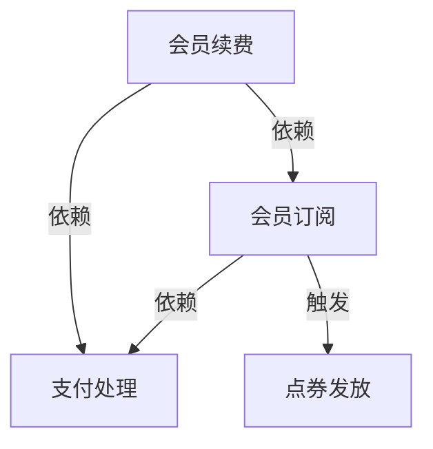

# 业务能力分析 SOP

## 概述

业务能力分析是 DDD 战略设计的第一步，用于识别组织的核心业务能力，为后续的限界上下文划分提供依据。

## 目标

- 识别组织的所有业务能力
- 对能力进行分层和分组
- 建立能力与组织的映射关系
- 为限界上下文划分提供输入

## 输入

- PRD（产品需求文档）
- 组织架构图
- 业务流程文档
- 干系人访谈记录

## 流程步骤

### Step 1: 能力识别

#### 1.1 从 PRD 提取能力动词

```
需求示例："用户可以订阅会员，系统每天为会员刷新 100 点券"

提取能力：
- 用户订阅管理
- 会员生命周期管理
- 点券发放
- 点券消费
```

#### 1.2 能力分类矩阵

| 层级 | 说明 | 示例 |
|------|------|------|
| **战略层** | 组织长期目标 | 用户增长、市场扩张 |
| **业务层** | 核心业务能力 | 会员管理、点券系统 |
| **战术层** | 具体功能 | 订阅、续费、发放 |

#### 1.3 能力格式规范

```
格式：{动词} + {名词}

示例：
✅ 好的能力定义
- 管理会员订阅
- 发放点券
- 处理支付

❌ 差的能力定义
- 会员（缺少动词）
- 管理（缺少对象）
- 点击按钮（太具体，是操作不是能力）
```

### Step 2: 能力分解

#### 2.1 能力分解树

```
会员管理
├── 会员订阅
│   ├── 创建订阅
│   ├── 续费订阅
│   └── 取消订阅
├── 会员权益
│   ├── 点券发放
│   └── 权益使用
└── 会员状态
    ├── 激活会员
    ├── 暂停会员
    └── 过期会员
```

#### 2.2 分解原则

| 原则 | 说明 | 示例 |
|------|------|------|
| **MECE** | 相互独立，完全穷尽 | 能力之间不重叠，覆盖所有业务 |
| **可独立交付** | 一个能力可独立开发和部署 | 会员订阅可独立迭代 |
| **单一职责** | 一个能力只做一件事 | 点券发放不包含会员创建 |

### Step 3: 能力分组

#### 3.1 分组维度

**按业务领域分组**：
- 用户域：用户注册、登录、认证
- 会员域：会员订阅、权益管理
- 支付域：支付、退款、对账

**按数据所有权分组**：
- 拥有"会员数据"的能力 → 会员域
- 拥有"点券数据"的能力 → 点券域

#### 3.2 能力依赖分析

```
能力依赖图：

订阅会员 ──依赖──▶ 支付处理
   │
   ├──触发──▶ 点券发放
   └──通知──▶ 会员通知
```

### Step 4: 团队对齐（Conway's Law）

#### 4.1 康威定律应用

```
系统架构 = 组织沟通架构

推论：
- 一个能力边界 = 一个团队边界
- 团队间沟通模式 = 系统间集成模式
```

#### 4.2 能力-团队映射表

| 能力组 | 负责团队 | 团队规模 | 联系方式 |
|--------|----------|----------|----------|
| 会员订阅 | 会员组 | 5 人 | @membership-team |
| 点券系统 | 积分组 | 3 人 | @coupon-team |
| 支付处理 | 支付组 | 4 人 | @payment-team |

### Step 5: 能力优先级

#### 5.1 领域类型识别

| 类型 | 特征 | 投入策略 | 示例 |
|------|------|----------|------|
| **核心域** | 竞争力所在，差异化 | 80% 精力 | 定价算法、推荐引擎 |
| **支撑域** | 必要但非差异化 | 够用就好 | 会员系统、通知系统 |
| **通用域** | 可直接采购 | 直接购买/外包 | 支付、短信、存储 |
| **泛化域** | 无特殊规则 | 最小投入 | 日志、监控 |

#### 5.2 优先级矩阵

```
┌─────────────────────────────────────┐
│      高业务价值    │      低业务价值    │
├──────────────────┼──────────────────┤
│ 核心域（优先）    │ 支撑域（其次）    │
│ - 会员订阅        │ - 通知系统        │
│ - 点券发放        │ - 报表系统        │
├──────────────────┼──────────────────┤
│ 支撑域（其次）    │ 通用域（购买）    │
│ - 用户管理        │ - 支付网关        │
│ - 权限系统        │ - 短信服务        │
└──────────────────┴──────────────────┘
     高技术差异          低技术差异
```

## 输出

### 业务能力清单模板

```markdown
## 业务能力清单

### 能力组：会员管理

| 能力 ID | 能力名称 | 领域类型 | 优先级 | 负责团队 | 依赖能力 |
|---------|----------|----------|--------|----------|----------|
| BC-001  | 会员订阅 | 核心域   | P0     | 会员组   | BC-005   |
| BC-002  | 会员续费 | 核心域   | P0     | 会员组   | BC-001   |
| BC-003  | 点券发放 | 核心域   | P0     | 积分组   | BC-001   |
| BC-004  | 会员过期 | 支撑域   | P1     | 会员组   | BC-001   |
| BC-005  | 支付处理 | 通用域   | P2     | 支付组   | -        |

### 能力依赖图


```

## 验收标准

- [ ] 所有业务能力已识别，使用"动词+名词"格式
- [ ] 能力分解遵循 MECE 原则
- [ ] 能力分组清晰，组内高内聚，组间低耦合
- [ ] 每个能力都有明确的负责团队
- [ ] 领域类型已标注（核心/支撑/通用/泛化）
- [ ] 能力依赖关系已明确
- [ ] 优先级已排序

## 常见问题

### Q1: 能力分解到什么程度？

**原则**：分解到"可独立开发交付"的最小粒度。

```
❌ 太粗：会员管理（包含太多）
❌ 太细：点击订阅按钮（太具体）
✅ 适中：会员订阅（独立可交付）
```

### Q2: 如何处理跨领域的能力？

**方法**：
1. 识别能力的所有权
2. 选择"主要数据所有者"作为归属
3. 通过领域事件协作

```
"支付成功通知"：
- 数据所有者：支付域（支付记录）
- 业务消费者：会员域（需要激活会员）
- 解决方案：支付域发布事件，会员域订阅
```

### Q3: 业务能力和限界上下文的关系？

```
业务能力分析 → 识别能力
         ↓
限界上下文划分 → 按能力分组划分上下文
         ↓
上下文映射 → 定义能力（上下文）间的协作
```

## 工具支持

- 能力画布（Business Capability Canvas）
- 依赖关系图（Dependency Graph）
- 团队-能力映射表（Team-Capability Mapping）

## 参考资料

- Domain-Driven Design (Eric Evans) - Chapter 4
- Strategic Domain-Driven Design (Vaughn Vernon)
- Business Capability Analysis practice
