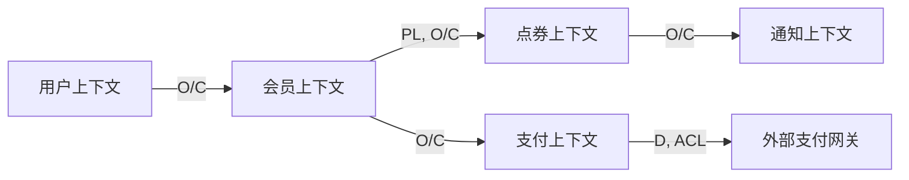
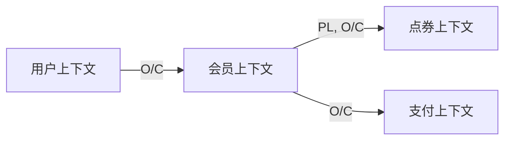

# 限界上下文划分 SOP

## 概述

限界上下文（Bounded Context）是 DDD 的核心战略概念，定义了特定领域模型的适用范围。本 SOP 提供系统化的上下文划分方法。

## 目标

- 清晰划分系统边界
- 确保上下文内部语言一致
- 建立上下文间的协作关系
- 支持独立部署和演进

## 输入

- 业务能力清单（BC-xxx）
- 组织架构图
- 现有系统架构文档

## 流程步骤

### Step 1: 上下文候选识别

#### 1.1 从能力组推导上下文

```markdown
业务能力组 → 限界上下文映射

会员管理能力组
├── 会员订阅 → 会员上下文
├── 会员权益 → 会员上下文
└── 会员状态 → 会员上下文

点券系统能力组
├── 点券发放 → 点券上下文
├── 点券消费 → 点券上下文
└── 点券查询 → 点券上下文
```

#### 1.2 上下文命名规范

```
格式：{核心领域} + Context

示例：
✅ Membership Context（会员上下文）
✅ Coupon Context（点券上下文）
✅ Payment Context（支付上下文）

❌ Member Context（不够明确）
❌ Coupon Service（是服务不是上下文）
```

### Step 2: 上下文边界确定

#### 2.1 边界确定原则

| 原则 | 说明 | 验证问题 |
|------|------|----------|
| **语言一致性** | 上下文内术语统一 | "会员"在这里的含义一致吗？ |
| **数据所有权** | 一个数据只有一个所有者 | "会员数据"归谁所有？ |
| **独立变更** | 可独立修改和部署 | 改这个上下文不影响其他？ |
| **事务边界** | 强一致性在上下文内 | 事务能在这个边界内完成？ |

#### 2.2 边界冲突检测

```
场景："会员"在多个上下文出现

冲突分析：
- 会员上下文：会员 = 订阅关系
- 用户上下文：会员 = 用户属性
- 支付上下文：会员 = 折扣标识

解决方案：
1. 明确各上下文"会员"的含义
2. 如果语义相同 → 考虑合并或共享内核
3. 如果语义不同 → 保持独立，通过 ID 引用
```

### Step 3: 上下文类型判定

#### 3.1 领域类型判定矩阵

| 判定维度 | 核心域 | 支撑域 | 通用域 | 泛化域 |
|----------|--------|--------|--------|--------|
| 业务价值 | 高 | 中 | 低 | 低 |
| 差异化 | 是 | 否 | 否 | 否 |
| 自研策略 | 必须 | 建议自研 | 建议采购 | 尽量简化 |
| 投入占比 | 60-80% | 10-20% | <10% | <5% |

#### 3.2 上下文类型标注

```markdown
## 上下文类型清单

| 上下文 | 类型 | 理由 | 投入策略 |
|--------|------|------|----------|
| 会员订阅 | 核心域 | 竞争力所在，差异化 | 80% 精力 |
| 点券系统 | 核心域 | 业务特色 | 70% 精力 |
| 支付处理 | 通用域 | 标准功能 | 采购/外包 |
| 消息通知 | 支撑域 | 必要但非核心 | 够用即可 |
| 日志监控 | 泛化域 | 无特殊规则 | 最小投入 |
```

### Step 4: 上下文职责定义

#### 4.1 职责定义模板

```markdown
## {上下文名称}

### 职责描述
{用一句话描述这个上下文负责什么}

### 核心概念
- {概念 1}：{定义}
- {概念 2}：{定义}

### 不负责（边界排除）
- ✗ {不属于这个上下文的内容}
- ✗ {需要委托给其他上下文的内容}

### 业务用例
- UC-01: {用例描述}
- UC-02: {用例描述}
```

#### 4.2 上下文职责示例

```markdown
## 会员上下文（Membership Context）

### 职责描述
管理用户的会员订阅生命周期和会员权益

### 核心概念
- **会员订阅**：用户与平台的订阅关系，有明确的起止时间
- **会员等级**：基于订阅金额和时间确定的不同权益等级
- **订阅状态**：待激活、生效中、已暂停、已过期

### 不负责
- ✗ 点券的发放和消费（点券上下文）
- ✗ 支付的处理（支付上下文）
- ✗ 用户的注册登录（用户上下文）

### 业务用例
- UC-01: 用户创建会员订阅
- UC-02: 会员订阅过期
- UC-03: 会员暂停/恢复
```

### Step 5: 上下文映射设计

#### 5.1 上下游关系识别

```markdown
## 上下游分析

问题：谁依赖谁？

判断方法：
1. 数据流方向：谁提供数据，谁消费数据？
2. 服务调用：谁的服务被调用？
3. 事件订阅：谁发布事件，谁订阅事件？

示例：
会员上下文 --发布会员激活事件--> 点券上下文
                                ↓
                        开始每日点券发放

结论：会员上下文是上游，点券上下文是下游
```

#### 5.2 上下文映射模式

| 模式 | 符号 | 说明 | 适用场景 |
|------|------|------|----------|
| **上游/下游** | O/C | 上游不关心下游 | 会员上下文 → 点券上下文 |
| **防腐层** | D | 下游隔离上游变化 | 依赖外部 API |
| **ACL** | ACL | 防腐层实现 | 转换上游模型 |
| **发布语言** | PL | 共享语言定义 | 跨上下文的事件 |
| **共享内核** | CF | 多上下文共享 | 核心领域概念 |
| **独占客户** | SC | 一个下游独占上游 | 特定业务定制 |
| **开放主机服务** | OH | 提供标准化 API | 对外服务 |

#### 5.3 上下文映射图

```markdown
## 上下文映射图



| 上游 | 下游 | 模式 | 说明 |
|------|------|------|------|
| 用户上下文 | 会员上下文 | O/C | 会员上下文依赖用户信息 |
| 会员上下文 | 点券上下文 | PL, O/C | 发布会员激活事件 |
| 支付上下文 | 外部网关 | D, ACL | 防腐层隔离外部变化 |
```

### Step 6: 团队对齐验证

#### 6.1 团队-上下文映射

```markdown
## 团队对齐

| 上下文 | 负责团队 | 团队规模 | 联系方式 |
|--------|----------|----------|----------|
| 用户上下文 | 用户组 | 3 人 | @user-team |
| 会员上下文 | 会员组 | 5 人 | @membership-team |
| 点券上下文 | 积分组 | 3 人 | @coupon-team |
| 支付上下文 | 支付组 | 4 人 | @payment-team |

验证：
- ✅ 一个上下文对应一个团队
- ✅ 团队规模合理（3-7 人）
- ✅ 沟通路径清晰
```

## 输出

### 限界上下文划分文档模板

```markdown
# 限界上下文划分文档

## 1. 上下文清单

| 上下文 ID | 上下文名称 | 类型 | 负责团队 | 状态 |
|-----------|------------|------|----------|------|
| BC-001 | 用户上下文 | 支撑域 | 用户组 | 已有 |
| BC-002 | 会员上下文 | 核心域 | 会员组 | 新增 |
| BC-003 | 点券上下文 | 核心域 | 积分组 | 新增 |
| BC-004 | 支付上下文 | 通用域 | 支付组 | 外部 |

## 2. 上下文详情

### BC-002: 会员上下文

**类型**：核心域
**负责团队**：会员组
**关联能力**：BC-001 会员订阅, BC-002 会员续费, BC-004 会员过期

#### 职责
- 管理会员订阅生命周期
- 维护会员状态和权益
- 发布会员状态变更事件

#### 核心概念
- **会员订阅**：用户与平台的订阅关系
- **订阅状态**：待激活、生效中、已暂停、已过期
- **会员等级**：普通、黄金、铂金

#### 不负责
- ✗ 点券的发放和消费
- ✗ 支付的处理
- ✗ 用户的注册登录

## 3. 上下文映射



| 上游 | 下游 | 模式 | 集成方式 |
|------|------|------|----------|
| 用户上下文 | 会员上下文 | O/C | 同步调用 |
| 会员上下文 | 点券上下文 | PL, O/C | 异步事件 |
| 会员上下文 | 支付上下文 | O/C | 同步调用 |
```

## 验收标准

- [ ] 每个上下文都有清晰的职责描述
- [ ] 上下文内部术语一致（Ubiquitous Language）
- [ ] 上下文边界清晰，不重叠
- [ ] 每个上下文都有明确的负责团队
- [ ] 上下文类型已正确标注（核心/支撑/通用/泛化）
- [ ] 上下文映射关系已明确
- [ ] 上下游关系清晰
- [ ] 防腐层需求已识别

## 常见问题

### Q1: 上下文应该多大？

**原则**：一个上下文应该能够独立部署和演进。

```
❌ 太大：整个系统一个上下文
❌ 太小：每个功能一个上下文
✅ 适中：一组相关的业务能力
```

### Q2: 两个上下文有重叠怎么办？

**方法**：
1. 分析重叠的原因（概念混淆、边界不清）
2. 明确各上下文中概念的真正含义
3. 如果是同一个概念 → 考虑合并或共享内核
4. 如果是不同概念 → 重命名以区分

### Q3: 上下文和微服务的关系？

```
限界上下文 ≠ 微服务

关系：
- 限界上下文是逻辑边界
- 微服务是物理边界
- 一个上下文可能对应一个或多个微服务
- 多个微服务可能组成一个上下文
```

## 工具支持

- 上下文映射图（Context Mapping Map）
- C4 Model（Context Diagram）
- Event Storming（事件风暴）

## 参考资料

- Domain-Driven Design (Eric Evans) - Chapter 14
- Strategic Domain-Driven Design (Vaughn Vernon)
- Context Mapping Patterns (Nick Tune)
